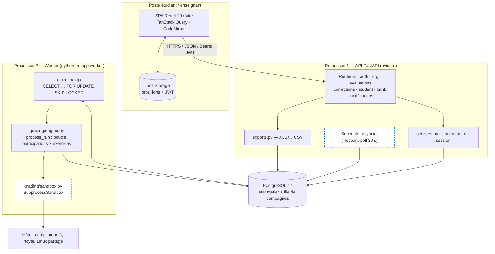
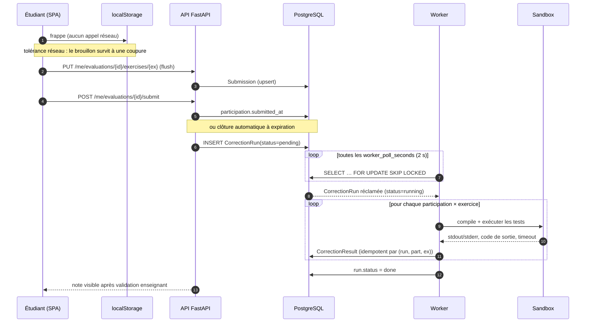
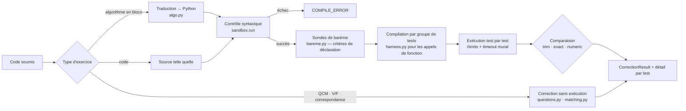
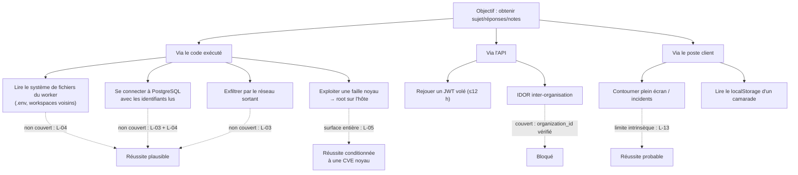
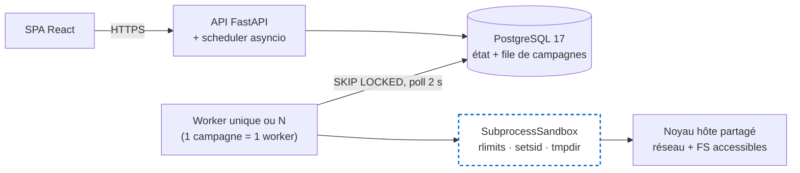
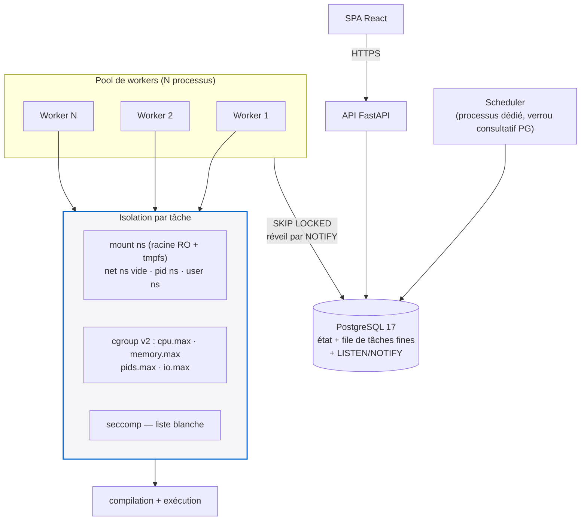
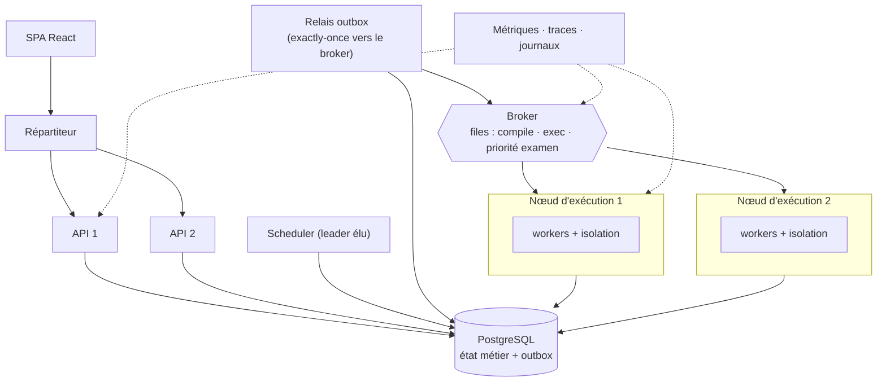
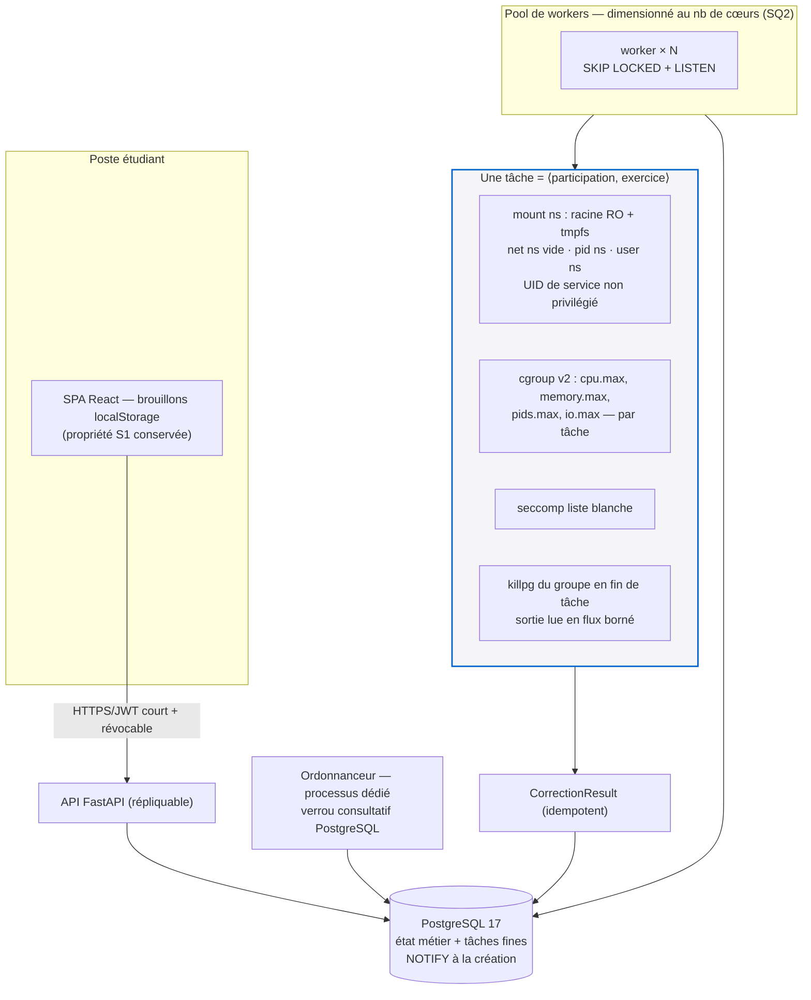
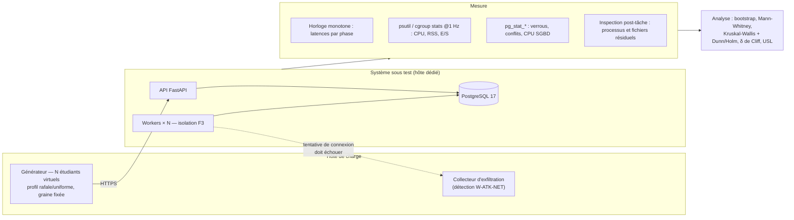

# Vers une architecture sûre et scalable pour l'évaluation en ligne de programmation : étude expérimentale du cas CodEval

**Towards a Secure and Scalable Architecture for Online Programming Assessment: An Experimental Study of the CodEval Platform**

*Protocole de recherche et cadre expérimental — Master 2 Génie Logiciel*
*Version 1.0 — document de travail. Aucune mesure expérimentale n'a encore été produite ; toutes les cellules de résultats portent la mention `À MESURER`.*

---

## Note de méthode sur le statut épistémique des énoncés

Ce document distingue systématiquement cinq statuts. Le lecteur — et le jury — doit pouvoir savoir, pour chaque affirmation, sur quoi elle repose.

| Marqueur | Signification |
|---|---|
| **[LIT]** | Résultat scientifique établi, publié et référencé dans la bibliographie |
| **[DOC]** | Documentation technique officielle (kernel.org, NIST, OWASP, PostgreSQL…) |
| **[OBS]** | Observation directe du code source de CodEval, vérifiable par lecture du dépôt (fichier et ligne cités) |
| **[HYP]** | Hypothèse de l'auteur, non démontrée à ce stade |
| **[EXP]** | Question qui ne peut être tranchée que par l'expérimentation décrite au §6 |

Un principe gouverne tout le document : **aucun résultat expérimental n'est inventé**. Les tableaux de résultats sont fournis vides, avec leur protocole de remplissage.

---

## Abstract

Online programming assessment platforms must execute untrusted student code on institutional infrastructure, under time pressure, and produce grades whose correctness and reproducibility can be defended academically. This work studies CodEval, a production-oriented assessment platform (React SPA, FastAPI, PostgreSQL, an independent correction worker, and a process-level sandbox) deployed in a university context. Rather than proposing a "modern" architecture a priori, we define an experimental protocol that allows the architectural decision itself to be derived from measurement. We contribute: (i) a code-level analysis of the current architecture that identifies a task-granularity bound — the unit of work is the whole evaluation campaign, not the individual submission — which caps the benefit of horizontal worker scaling for the dominant workload (one class corrected at once); (ii) a STRIDE-based threat model for untrusted code execution, mapped onto the isolation primitives actually present in the current sandbox (POSIX rlimits only: no namespaces, no cgroups, no seccomp filter, no network isolation); (iii) three candidate architectures (baseline, sharded workers with hardened isolation, brokered distributed execution) and four isolation strategies (process, namespaces+cgroups+seccomp, container runtime, microVM); (iv) a reproducible benchmark design with seven adversarial workload classes, latency percentiles, saturation analysis and non-parametric statistics; and (v) an explicit, pre-registered decision rule stating under which measured conditions the simplest architecture must be retained. No experimental results are reported: this document is the protocol, not its outcome.

**Résumé (FR).** Les plateformes d'évaluation en ligne de la programmation exécutent du code non fiable sur l'infrastructure de l'établissement, sous contrainte de temps, et doivent produire des notes défendables. Ce travail étudie CodEval (SPA React, FastAPI, PostgreSQL, worker de correction indépendant, bac à sable au niveau processus). Plutôt que de postuler une architecture « moderne », nous définissons un protocole expérimental permettant de *dériver* la décision architecturale de la mesure. Contributions : analyse au niveau du code identifiant une **borne de granularité** (l'unité de travail est la campagne, non la soumission) ; modèle de menaces STRIDE confronté aux primitives d'isolation réellement présentes ; trois architectures candidates et quatre stratégies d'isolation ; protocole de mesure reproductible avec sept classes de charges adverses et analyse statistique non paramétrique ; et une **règle de décision pré-enregistrée** énonçant à quelles conditions mesurées l'architecture la plus simple doit être conservée.

**Keywords:** online programming assessment, automated grading, untrusted code execution, sandboxing, seccomp, cgroups, container runtimes, microVM, job queue, PostgreSQL SKIP LOCKED, horizontal scalability, software architecture evaluation, threat modelling.

---

# 1. Introduction

## 1.1 Context

CodEval est une plateforme d'évaluation pratique de la programmation développée pour un usage universitaire : un enseignant compose une épreuve (exercices de code, d'algorithmique en blocs, QCM, vrai/faux, correspondances, questions rédigées), l'affecte à une classe, la programme ou la lance sur place ; les étudiants composent dans le navigateur ; le serveur corrige automatiquement, l'enseignant ajuste et publie les notes.

L'architecture observée dans le dépôt à la date de rédaction est la suivante **[OBS]** :

- **Frontend** : SPA React 19 / Vite 8, React Router 7, TanStack Query 5, CodeMirror 6. Pendant l'épreuve, la frappe n'est écrite que dans `localStorage` ; le réseau n'est sollicité qu'à la soumission, à l'expiration du temps, ou en quittant la page (`frontend/src/examStorage.js`, `frontend/src/pages/student/ExamPage.jsx`).
- **API** : FastAPI (Python 3.12), SQLAlchemy 2.0, PostgreSQL 17 (JSONB, enums natifs), sept routeurs (`auth`, `org`, `evaluations`, `corrections`, `student`, `bank`, `notifications`). Un ordonnanceur asyncio vit dans le `lifespan` de l'application et ouvre toutes les 30 s les évaluations programmées échues (`backend/app/scheduler.py`).
- **Worker de correction** : processus séparé (`python -m app.worker`) qui réclame les campagnes en attente par `SELECT … FOR UPDATE SKIP LOCKED` (`backend/app/worker.py:claim_next`).
- **Bac à sable** : `SubprocessSandbox` — processus fils, répertoire temporaire jetable, `setrlimit` (CPU, taille de fichier, descripteurs, et sous Linux seulement `RLIMIT_AS` et `RLIMIT_NPROC`), `os.setsid()`, délai mural via `subprocess.run(timeout=…)`, sorties tronquées après capture (`backend/app/grading/sandbox.py`).
- **Sécurité applicative** : JWT HS256 (12 h), PBKDF2-SHA256 240 000 itérations, rôles `teacher`/`student` en dépendances FastAPI, isolation par établissement rejouée dans les requêtes métier (`backend/app/security.py`, `backend/app/deps.py`, `backend/app/services.py:get_evaluation`).

Il n'existe **ni broker de messages, ni Redis, ni stockage objet, ni orchestrateur de conteneurs** dans le déploiement actuel.

## 1.2 Motivation

Trois tensions motivent cette étude.

**(a) Une tension de sécurité.** Un étudiant est, par construction, un utilisateur autorisé qui soumet du code arbitraire destiné à être compilé et exécuté sur l'infrastructure de l'université. La littérature sur la sécurité des conteneurs montre que l'isolation par simple séparation de processus laisse une surface d'attaque très large, l'ensemble des appels système du noyau hôte restant accessible (Sultan et al., 2019) **[LIT]**. Le guide NIST SP 800-190 formalise cette classe de risques pour les charges applicatives isolées (Souppaya et al., 2017) **[DOC]**.

**(b) Une tension de charge.** Une épreuve universitaire n'a pas un profil de charge lissé : 30 à 300 étudiants soumettent dans une fenêtre de quelques minutes, puis la correction doit être disponible rapidement. Le régime est donc *en rafale*, ce qui est précisément le régime où la théorie des files d'attente prédit que le temps de séjour explose quand l'utilisation approche 1 (Little, 1961) **[LIT]**.

**(c) Une tension de coût et de complexité.** Un laboratoire universitaire n'a ni l'équipe ni le budget d'exploitation d'un fournisseur cloud. Toute complexité ajoutée (broker, orchestrateur, microVM) doit être payée par un bénéfice mesuré, non postulé.

## 1.3 Problem Statement

Le problème n'est pas « quelle est la meilleure architecture d'exécution de code ? » — question mal posée, dont la réponse dépend du régime de charge et du modèle de menace. Le problème est :

> **Étant donné une charge d'évaluation universitaire réaliste et un modèle d'attaquant « étudiant soumettant du code arbitraire », quel est le point de l'espace de conception (granularité des tâches × mécanisme d'isolation × mécanisme de coordination) qui satisfait les exigences de sécurité et de latence de correction au moindre coût de complexité opérationnelle ?**

Un corollaire méthodologique, imposé par la règle fondamentale du §22 de la commande : l'étude doit être capable de **conclure au maintien de l'architecture actuelle** si les mesures le justifient.

## 1.4 Research Question

**QP (question principale).**
*Dans quelles conditions mesurables de charge (nombre de soumissions concurrentes, profil de programmes) et de modèle de menace, une évolution de l'architecture de CodEval — vers une granularité de tâche par soumission, une isolation renforcée par namespaces/cgroups/seccomp ou par runtime conteneurisé, et/ou une coordination par broker externe — produit-elle un gain de latence de correction, de débit, de robustesse et de confinement suffisant pour justifier son surcoût de complexité opérationnelle, par rapport à l'architecture actuelle (campagne monolithique, worker unique par campagne, bac à sable par processus, coordination PostgreSQL) ?*

Cette formulation est testable : chacun de ses termes (latence, débit, confinement, complexité) est opérationnalisé au §6.5 par une métrique et un seuil.

### Sous-questions

**SQ1 — Granularité.** Pour une évaluation de *N* étudiants, quelle est la relation entre le temps de correction de bout en bout et la granularité de l'unité de travail (campagne entière *vs* couple ⟨participation, exercice⟩) à nombre de workers constant ? Existe-t-il un *N* à partir duquel la granularité, et non le nombre de workers, devient le facteur limitant ? **[EXP]**

**SQ2 — Scalabilité horizontale et point de saturation.** Comment le débit de correction (soumissions·min⁻¹) et les percentiles P50/P95/P99 de latence évoluent-ils lorsque le nombre de workers passe de 1 à 2, 4, 8, 16 sur un hôte de *c* cœurs ? Le modèle de scalabilité universelle (Gunther, 2007) **[LIT]** ajuste-t-il les mesures, et quel coefficient de contention/cohérence en résulte ?

**SQ3 — Coordination.** À quelle charge de sollicitation la coordination par `SELECT … FOR UPDATE SKIP LOCKED` sur PostgreSQL **[DOC]** cesse-t-elle d'être suffisante (latence d'acquisition, taux de conflits, charge CPU du SGBD), et ce point est-il atteint avant ou après la saturation CPU des sandboxes ?

**SQ4 — Coût de l'isolation.** Quel est le surcoût mesuré (latence de démarrage, temps mural par exécution, mémoire résidente, débit) de chaque niveau d'isolation — processus + rlimits (actuel), namespaces + cgroups v2 + seccomp, conteneur OCI, runtime sandboxé type gVisor, microVM type Firecracker — sur les charges typiques de CodEval (compilation C + exécutions courtes de quelques centaines de millisecondes) ?

**SQ5 — Efficacité de confinement.** Face à un corpus reproductible d'attaques (boucle infinie, épuisement CPU/mémoire, explosion de processus, écriture disque massive, sortie gigantesque, accès réseau sortant, appels système sensibles), quelle proportion est neutralisée par chaque niveau d'isolation, et quel est l'impact résiduel mesuré sur les *autres* corrections en cours (interférence croisée) ?

**SQ6 — Décision coût/bénéfice.** Compte tenu de SQ1–SQ5, quelle configuration minimise le coût total (matériel + complexité opérationnelle estimée par un modèle explicite) sous les contraintes « aucune attaque du corpus non confinée » et « P95 du temps de correction d'une promotion de 200 étudiants ≤ seuil pédagogique fixé » ?

## 1.5 Research Objectives

### A. Objectif général

Déterminer, par une démarche expérimentale reproductible et non orientée, la configuration architecturale la plus appropriée à CodEval dans son contexte universitaire, en explicitant les compromis sécurité/performance/coût, et en acceptant comme issue possible le maintien de l'architecture existante.

### B. Objectifs spécifiques

| # | Objectif | Livrable | Section |
|---|---|---|---|
| OS1 | Analyser l'architecture actuelle au niveau du code et en dériver les limites *démontrées* | Analyse critique, distinction avéré/risque/à mesurer | §4 |
| OS2 | Établir l'état de l'art des systèmes d'évaluation, de l'isolation et des architectures d'exécution distribuées | Revue critique + tableau comparatif + *research gap* | §3 |
| OS3 | Construire un modèle de menaces spécifique à l'exécution de code étudiant | STRIDE, arbre d'attaque, matrice de risque | §5 |
| OS4 | Concevoir des architectures candidates répondant chacune à un problème identifié en OS1/OS3 | 3 architectures + 4 variantes d'isolation, diagrammes | §7 |
| OS5 | Définir un protocole expérimental reproductible | Environnement, charges, métriques, plan d'expériences | §6, §8 |
| OS6 | Définir l'analyse statistique adaptée au protocole | Répétitions, percentiles, tests non paramétriques, tailles d'effet | §6.7 |
| OS7 | Exécuter les expériences et analyser les résultats | Tableaux à remplir, figures attendues | §9 |
| OS8 | Formuler une recommandation architecturale justifiée par les mesures | Règle de décision pré-enregistrée + architecture finale | §11 |

## 1.6 Research Contributions

1. **Une borne de granularité identifiée par lecture du code** : dans CodEval, l'unité de travail réclamée par un worker est la *campagne de correction* (`CorrectionRun`), qui itère séquentiellement sur toutes les participations et tous les exercices (`backend/app/grading/engine.py:598-660`) **[OBS]**. `SKIP LOCKED` parallélise donc les corrections *entre évaluations*, jamais *à l'intérieur* d'une évaluation. Pour le cas d'usage dominant — une promotion corrigée d'un bloc — ajouter des workers n'apporte, en l'état, aucun gain. Ce constat déplace la question de recherche : avant de discuter broker et conteneurs, il faut discuter granularité.
2. **Une confrontation systématique entre les menaces modélisées et les primitives d'isolation réellement présentes**, plutôt qu'entre menaces et primitives supposées.
3. **Un protocole de benchmark adversarial** : sept classes de programmes dont cinq sont explicitement hostiles, mesurées non seulement sur leur propre sort mais sur leur *interférence* avec les corrections voisines.
4. **Une règle de décision pré-enregistrée** (§11.1), écrite *avant* les mesures, qui engage l'auteur à conclure au maintien de l'architecture simple si les seuils ne sont pas franchis. C'est le principal garde-fou contre le biais de confirmation architecturale.

---

# 2. Background

## 2.1 Online Programming Assessment

L'évaluation automatisée de la programmation est un champ ancien et bien cartographié. La revue systématique de Paiva, Leal et Figueira (2022) analyse 121 travaux publiés entre 2017 et 2021 et montre que la technique dominante reste dynamique — exécution de tests unitaires — devant l'analyse statique **[LIT]**. Une revue plus récente publiée dans *ACM Transactions on Computing Education* (Messer et al., 2024) confirme la centralité de l'exécution effective du code dans les outils de *grading* et de *feedback* **[LIT]**. Ce point est structurant : **l'exécution de code non fiable n'est pas un détail d'implémentation de ces plateformes, c'est leur cœur fonctionnel**, et donc leur cœur de risque.

CodEval se distingue de la plupart des systèmes recensés sur deux points **[OBS]** : (i) il évalue aussi des artefacts non exécutables (QCM, correspondances, algorithmique en blocs traduite en Python), ce qui rend la charge hétérogène ; (ii) il est conçu pour l'examen surveillé (fenêtre temporelle, plein écran, comptage d'incidents), et non pour le devoir asynchrone — d'où un profil de charge en rafale, alors que la littérature d'*autograding* décrit plutôt des soumissions étalées.

## 2.2 Code Execution Systems

Deux familles de systèmes servent de référence technique.

**Les juges en ligne de compétition.** DOMjudge, utilisé en régionales ICPC et comme support de cours **[DOC]**, sépare un serveur web d'un ou plusieurs *judgehosts* qui réclament des travaux et exécutent chaque soumission dans un bac à sable dédié. L'outil `isolate` (Mareš & Blackham, 2012), conçu pour l'IOI et adopté par plusieurs systèmes, repose explicitement sur les *namespaces* du noyau Linux et les cgroups plutôt que sur une simple séparation de processus **[LIT]**. C'est un point de comparaison direct pour CodEval : la communauté des concours a jugé, dès 2012, que le niveau « processus + rlimits » était insuffisant.

**L'exécution de code comme service.** Judge0 (Došilović & Mekterović, 2020) est décrit comme un système d'exécution de code en ligne modulaire, déployable sur plusieurs machines, où l'API, la file de travaux et les workers d'exécution sont des composants distincts **[LIT]**. Son architecture — API + file + workers + isolation par `isolate` — constitue une instance concrète de l'architecture candidate C du §7.3, ce qui permet de discuter cette dernière comme une option *documentée dans la littérature*, non comme une invention.

## 2.3 Sandboxing

Le noyau Linux expose trois familles de primitives dont la combinaison forme l'essentiel du confinement moderne **[DOC]** :

- les **namespaces** (`namespaces(7)`), qui virtualisent une ressource globale par processus : montages, PID, réseau, IPC, UTS, utilisateurs, cgroup, horloge ;
- les **cgroups v2** (`Documentation/admin-guide/cgroup-v2.rst`), qui *comptabilisent et plafonnent* les ressources — CPU, mémoire, E/S, nombre de PID — à l'échelle d'un groupe de processus, et non d'un processus isolé ;
- **seccomp-BPF** (`Documentation/userspace-api/seccomp_filter.rst`), qui réduit la surface d'appels système accessibles à un processus.

Cette distinction est capitale pour l'analyse de CodEval : `setrlimit(2)` — le seul mécanisme employé aujourd'hui **[OBS]** — n'appartient à aucune de ces trois familles. Les rlimits sont **par processus** (`RLIMIT_AS`, `RLIMIT_CPU`) ou **par UID réel** (`RLIMIT_NPROC`), jamais par « travail ». Un plafond par UID partagé avec le worker est un plafond que le code hostile peut consommer *au détriment du worker lui-même* (§4.7, L-06).

## 2.4 Containers

Un conteneur OCI est un assemblage de ces primitives, pas une frontière de sécurité nouvelle. Sultan et al. (2019) proposent une taxonomie en quatre cas (attaque conteneur→conteneur, conteneur→hôte, hôte→conteneur, extérieur→conteneur) et concluent que la sécurité des conteneurs reste dépendante de l'intégrité du noyau partagé **[LIT]**. NIST SP 800-190 formule les contre-mesures correspondantes au niveau image, registre, orchestrateur, conteneur et système hôte **[DOC]**. La réalité de la menace « évasion » est attestée : CVE-2019-5736 permettait à un conteneur d'écraser le binaire `runc` de l'hôte via une mauvaise gestion de `/proc/self/exe`, avec un score CVSS publié de 7,2 (NVD) — 7,7 selon certains distributeurs **[DOC]**.

## 2.5 MicroVMs

Firecracker (Agache et al., 2020) est un moniteur de machine virtuelle minimaliste écrit pour le serverless, en production chez AWS Lambda depuis 2018, qui vise une frontière matérielle (virtualisation) avec un temps de démarrage et une empreinte mémoire compatibles avec des charges très courtes **[LIT]**. L'intérêt pour CodEval est direct : une correction est exactement une charge très courte et fortement multi-tenante. La question n'est donc pas la pertinence conceptuelle mais le coût mesuré par exécution **[EXP]**.

Entre conteneur et microVM, gVisor interpose un noyau applicatif en espace utilisateur (le *Sentry*) : « aucun appel système n'est transmis directement à l'hôte », chaque appel supporté ayant une implémentation indépendante **[DOC]**. Le prix de cette indirection est documenté : Young et al. (2019) mesurent des appels système simples au moins 2,2× plus lents que sur conteneur classique, l'ouverture/fermeture de fichiers sur tmpfs externe jusqu'à 216× plus lente **[LIT]**.

## 2.6 Distributed Worker Systems

Trois résultats encadrent la partie « scalabilité » de ce travail.

- **Loi de Little** (Little, 1961) : en régime stationnaire, *L = λW* **[LIT]**. Conséquence opérationnelle : la longueur de file observée et le débit d'arrivée suffisent à prédire le temps de séjour moyen ; toute affirmation sur la latence devra être cohérente avec cette identité.
- **Loi de scalabilité universelle** (Gunther, 2007) : le débit d'un système parallèle est plafonné puis dégradé par deux coefficients, contention (sérialisation) et cohérence (échange entre nœuds) **[LIT]**. C'est le modèle d'ajustement retenu pour SQ2 : il permet d'estimer *où* se situe le maximum de débit plutôt que de constater seulement qu'il existe.
- **File dans la base** : `SKIP LOCKED` permet à plusieurs consommateurs de sauter les lignes verrouillées au lieu d'attendre **[DOC]**. C'est la technique employée par CodEval **[OBS]**. Sa limite théorique n'est pas la sémantique mais le coût : chaque tentative d'acquisition est une transaction, et le SGBD sert simultanément la charge métier.

---

# 3. State of the Art

Chaque sous-section suit la grille imposée : ce que propose la littérature, le problème résolu, les avantages, les limites, le contexte d'adéquation, l'adéquation à CodEval, le compromis introduit.

## 3.1 Existing Online Judges

**Ce que propose la littérature.** Judge0 (Došilović & Mekterović, 2020) formalise l'exécution de code comme un service à part entière : API de soumission, file de travaux persistante, workers d'exécution répliqués, isolation déléguée à un bac à sable spécialisé **[LIT]**. DOMjudge documente une séparation analogue serveur/judgehosts **[DOC]**. `isolate` (Mareš & Blackham, 2012) apporte la brique d'isolation : namespaces, cgroups, système de fichiers restreint, métrologie fine du temps et de la mémoire consommés **[LIT]**.

**Problème résolu.** Découpler la disponibilité de l'interface de la capacité d'exécution, et rendre l'exécution reproductible et mesurable (une note de concours doit être défendable).

**Avantages.** Granularité naturelle à la soumission ; ajout de capacité par ajout de judgehosts ; isolation éprouvée par des années de compétitions.

**Limites.** Ces systèmes sont conçus pour un modèle « une soumission = une exécution = un verdict », plus pauvre que le modèle de CodEval (barème à critères, tests d'appel de fonction, QCM, correspondances, algorithmique en blocs) **[OBS]**. Leur adoption telle quelle impliquerait de réécrire le moteur de barème, qui est précisément la valeur ajoutée pédagogique de CodEval.

**Contexte d'adéquation.** Concours, MOOC, plateformes d'entraînement à fort volume et faible richesse sémantique de correction.

**Adéquation à CodEval.** *Partielle et sélective.* Ce qu'il faut emprunter n'est pas le produit mais **deux décisions de conception** : (i) la granularité à la soumission, (ii) la délégation de l'isolation à un composant spécialisé du système, pas à `subprocess`.

**Compromis.** Adopter `isolate` introduit une dépendance à un binaire *setuid* et à une configuration cgroup de l'hôte — donc un coût d'exploitation et une nouvelle surface privilégiée, à mettre en balance avec le gain de confinement **[EXP]**.

## 3.2 Secure Code Execution

**Ce que propose la littérature.** Un continuum d'isolation, du plus léger au plus fort : processus + rlimits → namespaces + cgroups + seccomp → conteneur OCI durci → noyau applicatif en espace utilisateur (gVisor) → microVM (Firecracker). Les mesures comparatives existent et convergent : van Rijn & Rellermeyer (2021/2022) trouvent que les conteneurs classiques offrent la meilleure performance avec un surcoût minimal, tandis que les « conteneurs sécurisés » introduisent un coût d'efficacité mesurable **[LIT]** ; Viktorsson, Klein & Tordsson (2020) mesurent que runC surpasse les alternatives sécurisées jusqu'à 5×, que gVisor déploie jusqu'à 2× plus vite que Kata mais que Kata exécute jusqu'à 1,6× plus vite que gVisor **[LIT]** ; Wang, Du & Liu (2022) concluent que runC et Kata ont un surcoût moindre, gVisor souffrant surtout en E/S et en appels système, mais offrant la meilleure isolation **[LIT]**. Young et al. (2019) quantifient précisément ce coût côté gVisor **[LIT]**.

**Problème résolu.** Réduire la probabilité et l'impact d'une évasion, en réduisant la surface d'appels système exposée au code hostile.

**Avantages.** Frontière de sécurité explicite et documentée ; plafonnement des ressources par *groupe* de processus (cgroups) plutôt que par processus ou par UID ; possibilité de couper totalement le réseau (namespace réseau vide).

**Limites.** (i) Le surcoût est réel et dépend du profil : les charges dominées par les appels système et les E/S paient le plus **[LIT]** ; or la compilation C est précisément une charge à forte intensité d'E/S et d'appels système — d'où l'importance de mesurer *sur la charge de CodEval*, pas sur des benchmarks génériques. (ii) La sécurité conteneur reste conditionnée à l'intégrité du noyau partagé (Sultan et al., 2019) **[LIT]**, et l'existence de CVE-2019-5736 montre que l'évasion n'est pas théorique **[DOC]**.

**Contexte d'adéquation.** Multi-tenance non fiable : c'est exactement le contexte de CodEval.

**Adéquation à CodEval.** *Élevée pour les niveaux intermédiaires ; à démontrer pour les niveaux forts.* L'hypothèse de travail (à réfuter ou confirmer, §6.2) est que namespaces+cgroups+seccomp capture l'essentiel du gain de confinement pour un surcoût faible, et que gVisor/Firecracker ajoutent un surcoût difficile à amortir pour des exécutions de quelques centaines de millisecondes **[HYP]**.

**Compromis.** Chaque cran d'isolation échange du temps mural et de la mémoire contre une réduction de surface d'attaque, et ajoute une dépendance d'exploitation (noyau, runtime, images).

## 3.3 Scalable Execution Architectures

**Ce que propose la littérature.** Deux mécanismes de coordination coexistent : la file dans la base relationnelle (`SKIP LOCKED`) **[DOC]** et le courtier de messages dédié. La littérature de capacité (Gunther, 2007) enseigne que l'ajout de consommateurs n'améliore le débit que jusqu'au point où contention et cohérence dominent **[LIT]** ; la loi de Little (1961) relie file, débit et latence **[LIT]**.

**Problème résolu.** Absorber les rafales, découpler la production de travail de sa consommation, appliquer une contre-pression.

**Avantages de la file en base.** Une seule technologie à exploiter ; transactions et travaux partagent la même unité d'atomicité (pas de perte de travail entre commit métier et publication de message) ; sémantique *exactly-once* triviale à obtenir dans la même transaction.

**Limites de la file en base.** Le SGBD sert simultanément la charge métier et la coordination ; le *polling* introduit une latence plancher (ici 2 s par défaut, `worker_poll_seconds`) **[OBS]** ; le nettoyage (VACUUM) d'une table de travaux à fort taux de mise à jour peut devenir coûteux **[HYP, à mesurer]**.

**Avantages du broker.** Latence de distribution faible, contre-pression et *priorités* natives, découplage des domaines de panne.

**Limites du broker.** Un composant de plus à exploiter, à sauvegarder et à superviser ; risque de divergence entre l'état métier (PostgreSQL) et l'état de la file, qui doit être traité explicitement (*outbox*, idempotence).

**Adéquation à CodEval.** *À démontrer.* SQ3 est précisément la question de savoir si la coordination PostgreSQL sature avant les sandboxes. Si les sandboxes saturent d'abord — ce qui est l'hypothèse par défaut compte tenu du coût CPU d'une compilation C **[HYP]** — alors le broker résoudrait un problème que CodEval n'a pas, et NIST comme la littérature de capacité invitent à ne pas payer cette complexité.

## 3.4 Comparative Analysis

Évaluations qualitatives fondées sur les sources citées ; les colonnes « Performance » sont des *ordres de grandeur issus de la littérature*, non des mesures sur CodEval. Elles seront remplacées par les mesures du §9 (SQ4).

**Tableau 3.1 — Mécanismes d'isolation**

| Solution | Isolation | Performance | Scalabilité | Complexité | Coût | Maturité | Adaptation à CodEval |
|---|---|---|---|---|---|---|---|
| Processus + rlimits (**actuel**) | Faible : noyau hôte entièrement exposé, pas de namespace réseau ni de cgroup **[OBS]** | Optimale (référence) | Bonne mais bornée par la granularité **[OBS]** | Très faible | Nul | Élevée (POSIX) | **Insuffisante pour le modèle de menace** (§5) |
| Namespaces + cgroups v2 + seccomp | Moyenne-forte : réseau coupable, PID/mount isolés, ressources plafonnées par groupe, surface d'appels réduite **[DOC]** | Surcoût attendu faible **[HYP, EXP]** | Bonne | Moyenne (config. noyau, droits) | Nul (noyau) | Élevée ; base d'`isolate` depuis 2012 **[LIT]** | **Candidat principal** |
| Conteneur OCI (runC) | Moyenne-forte, équivalente à la ligne précédente + gestion d'images | Meilleure des runtimes comparés, jusqu'à 5× plus rapide que les alternatives sécurisées **[LIT]** | Bonne | Moyenne-élevée (démon, images, registre) | Faible-moyen | Très élevée | Candidat ; surcoût d'exploitation à justifier |
| Conteneur + seccomp/AppArmor durci | Forte | Proche de runC | Bonne | Élevée (profils à maintenir) | Faible-moyen | Élevée | Candidat si la politique d'appels est stabilisée |
| gVisor | Très forte : aucun appel transmis directement à l'hôte **[DOC]** | Dégradation marquée en E/S et appels système : ≥2,2× sur appels simples, jusqu'à 216× sur ouverture/fermeture tmpfs externe **[LIT]** | Bonne | Élevée | Moyen | Élevée (production Google) | **A priori défavorable** : la compilation C est intensive en E/S et appels système **[HYP, EXP]** |
| MicroVM (Firecracker) | Très forte (frontière matérielle) **[LIT]** | Démarrage et empreinte optimisés pour le serverless, mais surcoût par exécution non nul **[LIT]** | Bonne | Élevée (images noyau, réseau, orchestration) | Moyen-élevé | Élevée (AWS Lambda) **[LIT]** | À évaluer ; probablement surdimensionné pour un TP universitaire **[HYP, EXP]** |

**Tableau 3.2 — Mécanismes de coordination**

| Mécanisme | Latence de distribution | Atomicité avec l'état métier | Contre-pression | Complexité opérationnelle | Adéquation CodEval |
|---|---|---|---|---|---|
| PostgreSQL `SKIP LOCKED` + polling (**actuel**) | Plancher = période de polling (2 s) **[OBS]** | Native (même transaction) | Implicite (file = table) | Nulle (déjà déployé) | Suffisante **si** SQ3 le confirme |
| PostgreSQL `SKIP LOCKED` + `LISTEN/NOTIFY` | Faible | Native | Implicite | Très faible | Amélioration à coût quasi nul **[HYP]** |
| Broker dédié (AMQP/Redis Streams) | Faible | À construire (outbox + idempotence) | Native, riche | Élevée | À justifier par SQ3 |

## 3.5 Research Gap

Trois manques ressortent de cette revue.

1. **La littérature d'isolation mesure des benchmarks génériques** (E/S, appels système, calcul), pas le profil réel d'une correction académique — *compiler un petit programme C puis l'exécuter quelques centaines de millisecondes, plusieurs centaines de fois en rafale*. Les résultats de Young et al. (2019), Viktorsson et al. (2020), Wang et al. (2022) et van Rijn & Rellermeyer (2021) sont directionnels mais non transposables tels quels **[LIT]**.
2. **La littérature d'*automated assessment* décrit abondamment les techniques de notation** (Paiva et al., 2022 ; Messer et al., 2024) **[LIT]** mais traite rarement l'architecture d'exécution comme un objet d'étude expérimental, avec seuils, saturation et coût.
3. **Aucune des sources consultées ne traite la granularité de la tâche comme variable indépendante.** Or c'est, dans le cas de CodEval, la variable dont l'effet est le plus probable **[OBS + HYP]**. C'est le gap que ce travail vise en priorité.

---

# 4. CodEval Current Architecture

## 4.1 Functional Context

Deux rôles seulement existent dans le modèle (`Role.TEACHER`, `Role.STUDENT`) **[OBS]** ; l'administration d'établissement est assurée par le premier enseignant inscrit. Le cycle de vie d'une épreuve est un automate à sept états : `draft → scheduled → running → closed → correcting → corrected → validated`.

## 4.2 Architecture

*(Les deux composants en rose sont ceux dont l'analyse du §4.7 démontre les limites les plus fortes : le bac à sable et l'ordonnanceur intégré à l'API.)*

## 4.3 Components

| Composant | Fichier | Responsabilité | Réplicable en l'état ? |
|---|---|---|---|
| SPA | `frontend/src/` | Composition, passage d'épreuve, consultation | Oui (statique) |
| API | `backend/app/main.py` + routeurs | CRUD métier, autorisation, exports | **Non sans précaution** : porte l'ordonnanceur **[OBS]** |
| Ordonnanceur | `backend/app/scheduler.py` | Ouvre les épreuves programmées échues (poll 30 s) | Non : pas d'élection de leader ni de verrou consultatif **[OBS]** |
| Worker | `backend/app/worker.py` | Réclame et exécute les campagnes | Oui, mais gain borné par la granularité **[OBS]** |
| Moteur | `backend/app/grading/engine.py` | Barème, tests, appels de fonction, QCM | — |
| Bac à sable | `backend/app/grading/sandbox.py` | Exécution du code étudiant | — |
| Base | PostgreSQL 17 | État métier **et** file de travaux | Vertical seulement en l'état |

## 4.4 Data Flow

## 4.5 Execution Flow

## 4.6 Strengths

Cinq propriétés de l'architecture actuelle sont, à l'analyse, de bonnes décisions qu'il faut préserver dans toute évolution **[OBS]**.

- **S1 — Le chemin critique de l'épreuve ne dépend pas du réseau.** Les brouillons vivent dans `localStorage` ; une coupure pendant la composition ne détruit pas le travail. Peu de plateformes d'examen offrent cette propriété, qui est un choix architectural fort, pas un détail.
- **S2 — Découplage API/correction déjà réalisé.** La charge CPU de la correction ne dégrade pas les temps de réponse pendant l'épreuve, ce qui est la propriété la plus importante pendant la fenêtre d'examen.
- **S3 — Idempotence de la correction.** `process_run` saute tout `CorrectionResult` déjà présent pour `(run, participation, exercice)` : un worker tué en cours de route peut reprendre sans double comptage.
- **S4 — Coordination sans composant supplémentaire.** `SKIP LOCKED` fournit une file correcte, transactionnelle et sans dépendance nouvelle **[DOC]**.
- **S5 — Abstraction d'isolation déjà en place.** Le `Protocol Sandbox` permet de substituer l'implémentation sans toucher au moteur : **le coût de migration vers une isolation forte est faible**, ce qui est un argument méthodologique majeur — l'expérimentation du §6 est réalisable sans refonte.

## 4.7 Limitations

Chaque limite est classée : **avérée** (démontrable par lecture du code), **risque potentiel** (plausible, non démontré), **à mesurer** (relève de l'expérimentation).

| # | Limite | Statut | Fondement |
|---|---|---|---|
| **L-01** | **Granularité de la tâche = campagne entière.** `process_run` itère séquentiellement sur toutes les participations et tous les exercices d'une évaluation. Une promotion = une tâche = un worker. | **Avérée** | `engine.py:598-660` **[OBS]** |
| **L-02** | **`SKIP LOCKED` ne parallélise qu'entre évaluations.** Corollaire de L-01 : ajouter des workers n'accélère pas la correction d'une classe unique. | **Avérée** | `worker.py:claim_next` + L-01 **[OBS]** |
| **L-03** | **Aucune isolation réseau.** Le processus fils hérite de la pile réseau de l'hôte : le code étudiant peut ouvrir des connexions sortantes. | **Avérée** | `sandbox.py` : aucun `unshare`/`CLONE_NEWNET` **[OBS]** |
| **L-04** | **Aucune isolation du système de fichiers.** Pas de `chroot`, pas de *mount namespace* : le code s'exécute avec l'UID du worker et lit ce que cet UID peut lire (y compris `.env`, si les droits le permettent). `RLIMIT_FSIZE` limite la *taille* des fichiers, pas leur *emplacement*. | **Avérée** | `sandbox.py:_limits`, `SubprocessSandbox.run` **[OBS]** |
| **L-05** | **Pas de seccomp.** Toute la surface d'appels système du noyau hôte est atteignable. | **Avérée** | Absence dans `sandbox.py` **[OBS]** |
| **L-06** | **`RLIMIT_NPROC` est par UID réel, non par tâche.** Un plafond de 64 processus est partagé avec le worker : une explosion de processus peut empêcher le worker de créer les siens. | **Avérée** (mécanisme documenté **[DOC]**) ; ampleur **à mesurer** | `sandbox.py:_limits` **[OBS]** |
| **L-07** | **Le délai mural ne tue que l'enfant direct.** `subprocess.run(timeout=…)` tue le processus lancé ; les petits-enfants issus d'un `fork()` ne sont pas dans le périmètre, bien qu'un `setsid()` ait créé une session. Aucun `killpg` n'est effectué. | **Avérée** | `sandbox.py:run` **[OBS]** |
| **L-08** | **La sortie est tronquée après capture intégrale.** `capture_output=True` bufferise dans le worker, puis `[:cap]` tronque. `RLIMIT_AS` protège l'enfant, pas la mémoire du worker. Un programme écrivant massivement sur stdout consomme la mémoire du worker. | **Avérée** ; ampleur **à mesurer** | `sandbox.py:run` **[OBS]** |
| **L-09** | **Protection dégradée hors Linux.** `RLIMIT_AS` et `RLIMIT_NPROC` ne sont posés que sous Linux : sur poste de développement macOS, ni mémoire ni processus ne sont plafonnés. | **Avérée** | `sandbox.py:_limits` **[OBS]** |
| **L-10** | **L'ordonnanceur vit dans l'API.** Répliquer l'API réplique l'ordonnanceur : deux instances peuvent tenter d'ouvrir la même session. `require_status` rend la seconde tentative inopérante, mais aucun verrou consultatif n'est pris. | **Avérée** (conception) ; impact **à mesurer** | `main.py:lifespan`, `scheduler.py` **[OBS]** |
| **L-11** | **Latence plancher de distribution de 2 s** (`worker_poll_seconds`), sans `LISTEN/NOTIFY`. | **Avérée** | `config.py`, `worker.py` **[OBS]** |
| **L-12** | **JWT de 12 h, sans révocation, stocké en `localStorage`.** Un jeton exfiltré (XSS, poste partagé) reste valide toute la journée d'examen. | **Avérée** (conception) | `config.py:access_token_minutes`, `api/client.js` **[OBS]** |
| **L-13** | **L'intégrité de l'épreuve est contrôlée côté client** (plein écran, comptage de sorties). Un étudiant maîtrisant son navigateur contourne ces contrôles. | **Avérée** (limite intrinsèque) | `ExamPage.jsx` **[OBS]** |
| **L-14** | **Absence de limitation de débit** sur les points d'entrée étudiants (autosave, incidents). | **Risque potentiel** | Aucun *rate limiter* observé **[OBS]** |
| **L-15** | **Coût du VACUUM / de la fragmentation** sur les tables de campagnes et de résultats sous forte rotation. | **À mesurer** | **[EXP]** |
| **L-16** | **Contention CPU entre compilations concurrentes** (le compilateur C est lui-même multi-processus). | **À mesurer** | **[EXP]** |

> **Point de méthode.** L-01/L-02 sont la découverte centrale de cette analyse et elles *réordonnent la problématique* : tant que l'unité de travail est la campagne, le débat « broker ou pas broker » est prématuré. Un broker distribuant une tâche par promotion ne ferait pas mieux que PostgreSQL distribuant une tâche par promotion.

---

# 5. Security Threat Model

## 5.1 Assets

| ID | Actif | Propriété à protéger | Impact d'une compromission |
|---|---|---|---|
| A1 | Sujets d'épreuve non encore passés | Confidentialité | Invalidation de l'épreuve |
| A2 | Copies et notes | Intégrité, non-répudiation | Contestation, fraude sur note |
| A3 | Secret JWT, identifiants de base (`.env`) | Confidentialité | Compromission totale de la plateforme |
| A4 | Disponibilité pendant la fenêtre d'examen | Disponibilité | Épreuve à refaire, préjudice pédagogique |
| A5 | Hôte d'exécution et son noyau | Intégrité | Pivot vers le SI de l'établissement |
| A6 | Données personnelles (identité, matricule, résultats) | Confidentialité | Obligations légales |
| A7 | Sel de correspondance et clés de barème (`SALT_KEY`) | Confidentialité | Réponses déductibles |

## 5.2 Actors

| Acteur | Capacités | Motivation |
|---|---|---|
| **Étudiant honnête** | Soumet du code correct | — |
| **Étudiant opportuniste** | Exploite ce qui traîne : lecture de fichiers, contournement du plein écran | Améliorer sa note |
| **Étudiant compétent hostile** | Écrit du code visant explicitement le bac à sable ; connaît Linux | Note, exfiltration du sujet, sabotage |
| **Étudiant coalisé** | Plusieurs comptes coordonnés | Déni de service sur la fenêtre d'examen |
| **Enseignant** | Confiance élevée mais périmètre limité à son organisation | Erreur ou abus interne |
| **Externe non authentifié** | Surface HTTP publique | Vol de compte, DoS |

L'acteur dimensionnant est **l'étudiant compétent hostile** : il est authentifié, légitime, et son vecteur d'attaque — soumettre du code — est la fonction même du système.

## 5.3 Threats (STRIDE)

| STRIDE | Menace instanciée sur CodEval | Actif | Protection actuelle **[OBS]** |
|---|---|---|---|
| **S**poofing | Vol de JWT (12 h, `localStorage`), usurpation en salle | A2, A6 | HTTPS, signature HS256 ; **pas de révocation** (L-12) |
| **T**ampering | Modification de copie après clôture ; falsification de résultats depuis le code exécuté (accès à la base si les identifiants sont lisibles) | A2, A3 | Automate d'états côté serveur ; **aucune isolation FS** (L-04) |
| **R**epudiation | « Ma copie n'a pas été envoyée » | A2 | `AuditLog`, horodatages, `submitted_at` |
| **I**nformation disclosure | Lecture de `.env`, du sujet d'une autre épreuve, du sel de barème, exfiltration réseau des données lues | A1, A3, A7 | **Aucune** au niveau du bac à sable (L-03, L-04) |
| **D**enial of service | Boucle infinie, bombe à fork, saturation mémoire du worker par la sortie, saturation disque | A4 | rlimits partiels ; **trous L-06, L-07, L-08** |
| **E**levation of privilege | Exploitation d'une vulnérabilité noyau depuis le code étudiant, exécuté avec l'UID du worker | A5 | **Aucune réduction de surface** (L-05) |

## 5.4 Attack Scenarios

### Arbre d'attaque — objectif : obtenir les sujets ou les réponses

**Scénario détaillé S1 — exfiltration du sujet.** Un étudiant soumet, pour un exercice de code, un programme C qui (i) énumère `/tmp` à la recherche des répertoires `codeval-*` d'autres corrections, (ii) lit le fichier `.env` du backend si les droits POSIX le permettent, (iii) ouvre une socket TCP sortante vers un serveur qu'il contrôle. Chacune des trois étapes est aujourd'hui non entravée par le bac à sable **[OBS : L-03, L-04, L-05]**. La seule barrière est la politique de droits POSIX de l'hôte, qui n'est pas une propriété de l'application et n'est vérifiée par aucun test. → **Priorité 1.**

**Scénario détaillé S2 — déni de service de la fenêtre d'examen.** Vingt étudiants soumettent une bombe à fork. Chaque exécution consomme jusqu'à `RLIMIT_NPROC` processus *sur l'UID du worker* (L-06) ; le délai mural tue l'enfant direct mais pas ses descendants (L-07). → Le worker peut se retrouver incapable de créer un processus pour la correction suivante. **Statut : mécanisme avéré, ampleur à mesurer (§6.4, W6).**

**Scénario détaillé S3 — épuisement mémoire du worker.** Un programme écrit 4 Gio sur `stdout`. `RLIMIT_AS` plafonne l'enfant, mais c'est le *parent* qui bufferise via `capture_output` avant troncature (L-08). → **À mesurer (W5)** : point de rupture en Mio écrits.

## 5.5 Risk Analysis

Probabilité et impact sur échelle 1–5 ; Risque = P × I. Les vecteurs CVSS ne sont fournis que pour les menaces où une référence publique existe.

| ID | Menace | P | I | Risque | Protection actuelle | Protection proposée | Moyen de validation |
|---|---|---|---|---|---|---|---|
| T1 | Exfiltration réseau depuis le code étudiant | 4 | 5 | **20** | Aucune (L-03) | Namespace réseau vide (`CLONE_NEWNET` sans interface) **[DOC]** | W-ATK-NET : toute tentative de connexion doit échouer (§6.4) |
| T2 | Lecture du FS hôte (.env, autres workspaces) | 4 | 5 | **20** | Aucune (L-04) | Mount namespace + racine minimale en lecture seule + UID dédié non privilégié | W-ATK-FS : lecture de `/etc/passwd`, `.env`, `/tmp/codeval-*` doit échouer |
| T3 | Explosion de processus dégradant le worker | 3 | 4 | **12** | `RLIMIT_NPROC` par UID (L-06), timeout partiel (L-07) | `pids.max` cgroup v2 par tâche + `killpg` du groupe de session **[DOC]** | W6 : nb de processus survivants après timeout = 0 |
| T4 | Épuisement mémoire du worker par la sortie | 3 | 4 | **12** | Troncature *a posteriori* (L-08) | Lecture bornée en flux (arrêt à la limite) + `memory.max` cgroup | W5 : RSS du worker plafonné quel que soit le volume écrit |
| T5 | Évasion du bac à sable via faille noyau | 2 | 5 | **10** | Aucune réduction de surface (L-05) | seccomp (liste blanche) ; à défaut gVisor ou microVM **[LIT]** | Comptage des appels système refusés ; revue de la politique |
| T6 | Rejeu d'un JWT volé | 3 | 3 | 9 | Expiration 12 h (L-12) | Durée courte + `jti` révocable + liaison à la session d'épreuve | Test d'intégration : jeton révoqué → 401 |
| T7 | Épuisement CPU (boucle infinie de masse) | 4 | 2 | 8 | `RLIMIT_CPU` + timeout mural | `cpu.max` cgroup + quota global de campagne | W4 : temps mural borné, interférence mesurée |
| T8 | Saturation disque | 2 | 3 | 6 | `RLIMIT_FSIZE` (8 Mio/fichier) | Quota de workspace (tmpfs dimensionné) | W-ATK-DISK |
| T9 | Contournement des contrôles d'intégrité côté client | 5 | 2 | 10 | Contrôles clients (L-13) | Reconnaître la limite ; corréler les signaux serveur ; surveillance humaine | Hors périmètre expérimental — **limite assumée (§12)** |
| T10 | Évasion de runtime conteneur si conteneurisation adoptée | 1 | 5 | 5 | Sans objet | Runtime à jour, `no-new-privileges`, utilisateur non root, seccomp par défaut **[DOC]** | Veille CVE ; cf. CVE-2019-5736 **[DOC]** |

**Lecture.** Les deux risques majeurs (T1, T2) ne relèvent ni du débit, ni de l'orchestration : ils relèvent du **niveau d'isolation**. Une conclusion importante s'impose déjà : *si l'étude devait s'arrêter à ce point faute de temps expérimental, la priorité ne serait pas de distribuer, mais d'isoler.*

---

# 6. Research Methodology

## 6.1 Research Questions

Reprise de QP et SQ1–SQ6 (§1.4), chacune rattachée à ses expériences.

| Question | Expériences | Métriques principales |
|---|---|---|
| SQ1 Granularité | E1, E2 | Temps de correction de bout en bout, débit, utilisation des workers |
| SQ2 Scalabilité | E2, E3 | Débit, P50/P95/P99, ajustement USL |
| SQ3 Coordination | E3, E4 | Latence d'acquisition, conflits, CPU PostgreSQL |
| SQ4 Coût de l'isolation | E5 | Latence de démarrage, temps mural, RSS, débit |
| SQ5 Confinement | E6 | Taux d'attaques neutralisées, interférence croisée |
| SQ6 Décision | Toutes | Fonction de coût §11.1 |

## 6.2 Hypotheses

Les hypothèses sont formulées avec leur **prédiction falsifiable** et le **critère de réfutation**.

**H1 — Granularité dominante.** *Pour une évaluation unique de N ≥ 50 participations, le temps de correction de bout en bout de l'architecture actuelle est indépendant du nombre de workers, alors qu'il décroît d'un facteur croissant avec le nombre de workers si l'unité de travail est le couple ⟨participation, exercice⟩.*
→ Réfutée si le temps de correction de l'architecture A diminue significativement (Mann-Whitney, α = 0,05) entre 1 et 8 workers.
→ Fondement : L-01/L-02 **[OBS]**.

**H2 — Saturation sous-linéaire.** *Le débit de correction croît avec le nombre de workers jusqu'à un maximum situé au voisinage du nombre de cœurs physiques disponibles, puis stagne ou décroît ; le modèle USL (Gunther, 2007) ajuste les mesures avec R² ≥ 0,9.*
→ Réfutée si le débit croît linéairement au-delà du nombre de cœurs, ou si l'ajustement USL est mauvais (auquel cas un autre modèle devra être discuté).

**H3 — La base n'est pas le goulot.** *Dans le régime étudié (≤ 16 workers, ≤ 1000 soumissions), la coordination PostgreSQL représente moins de 5 % du temps de correction de bout en bout et moins de 10 % du CPU total consommé.*
→ Réfutée si la latence d'acquisition ou le CPU du SGBD dépasse ces seuils : dans ce cas seulement, un broker devient justifiable.

**H4 — Coût d'isolation croissant et non uniforme.** *Le surcoût relatif par correction croît strictement dans l'ordre {processus+rlimits} < {namespaces+cgroups+seccomp} < {conteneur OCI} < {gVisor} < {microVM}, et le surcoût de gVisor sur la phase de compilation est significativement supérieur à son surcoût sur la phase d'exécution.*
→ Fondement directionnel : Young et al. (2019), Viktorsson et al. (2020), Wang et al. (2022) **[LIT]**.
→ Réfutée si l'ordre observé diffère, ou si les intervalles de confiance se recouvrent.

**H5 — Suffisance de l'isolation intermédiaire.** *La configuration {namespaces + cgroups v2 + seccomp} neutralise 100 % du corpus d'attaques W-ATK pour un surcoût médian par correction inférieur à 15 % par rapport à la baseline.*
→ Réfutée si une attaque du corpus passe, ou si le surcoût médian dépasse 15 %.
→ C'est **l'hypothèse centrale de la décision architecturale**.

**H6 — Non-rentabilité de la distribution.** *Sur un hôte unique correctement dimensionné, l'introduction d'un broker externe n'améliore pas le P95 du temps de correction de plus de 10 % par rapport à la file PostgreSQL avec granularité fine et `LISTEN/NOTIFY`.*
→ Réfutée si le gain dépasse 10 % de façon statistiquement significative.
→ Formulée délibérément dans le sens « la complexité ne paie pas », pour que sa réfutation — et non sa confirmation — soit ce qui justifie le broker.

## 6.3 Experimental Design

**Type.** Expérience factorielle contrôlée, à trois facteurs principaux :

- **F1 — Granularité** : {campagne (actuel), soumission-exercice}
- **F2 — Parallélisme** : {1, 2, 4, 8, 16 workers}
- **F3 — Isolation** : {processus+rlimits, ns+cgroups+seccomp, conteneur OCI, gVisor, microVM}

Un plan factoriel complet 2 × 5 × 5 = 50 cellules × 6 niveaux de charge × 10 répétitions est irréaliste. On adopte un **plan fractionnaire en trois blocs** :

| Bloc | Facteurs variés | Facteurs fixés | Questions traitées |
|---|---|---|---|
| **B1 — Granularité** | F1 × F2 | F3 = baseline | SQ1, SQ2 (H1, H2) |
| **B2 — Coordination** | F2 × charge | F1 = fine, F3 = baseline | SQ3 (H3, H6) |
| **B3 — Isolation** | F3 | F1 = fine, F2 = nb cœurs | SQ4, SQ5 (H4, H5) |

**Contrôles.** Ordre des exécutions randomisé ; une phase de chauffe écartée de l'analyse ; hôte dédié sans autre charge ; gouverneur CPU en mode `performance` ; *hyper-threading* et *turbo* documentés et fixés ; horloge monotone pour toutes les mesures.

**Reproductibilité.** Chaque expérience est décrite par un fichier de configuration versionné (charge, nombre de workers, isolation, graine aléatoire) ; les journaux bruts et les scripts d'analyse sont archivés en annexe C.

## 6.4 Workloads

### A. Niveaux de charge

Six niveaux, correspondant à des **scénarios expérimentaux et non à des capacités garanties** :

| Niveau | Étudiants simulés | Exercices/épreuve | Soumissions totales | Motivation |
|---|---|---|---|---|
| C1 | 10 | 4 | 40 | TP en salle |
| C2 | 50 | 4 | 200 | Groupe de TD |
| C3 | 100 | 4 | 400 | Promotion L2 |
| C4 | 250 | 4 | 1 000 | Promotion entière |
| C5 | 500 | 4 | 2 000 | Examen inter-filières |
| C6 | 1 000 | 4 | 4 000 | Charge de rupture recherchée |

Profil d'arrivée : deux régimes testés — **rafale** (90 % des soumissions dans les 120 dernières secondes, cas réaliste d'examen) et **uniforme** (contrôle).

### B. Classes de programmes

Sept classes, dont cinq adverses. Chaque classe est un programme C figé, versionné en annexe B, avec un comportement attendu explicite.

| ID | Classe | Description | Comportement attendu du système |
|---|---|---|---|
| W1 | Trivial | Lecture de deux entiers, addition, affichage | Correction < 1 s |
| W2 | CPU-intensif | Boucle arithmétique ~3 s CPU | Termine sous `RLIMIT_CPU`, ou marqué TIMEOUT |
| W3 | Mémoire-intensif | Allocation croissante jusqu'à 1 Gio | Échec d'allocation contenu, worker non affecté |
| W4 | Boucle infinie | `while(1);` | Tué par le délai mural, temps borné |
| W5 | Sortie massive | 4 Gio sur stdout | Sortie tronquée **sans** croissance du RSS du worker |
| W6 | Explosion de processus | `fork()` en boucle | Aucun processus survivant après la correction |
| W7 | Compilation lente | ~2 000 lignes, macros et gabarits imbriqués | Termine sous le délai de compilation |

Corpus d'attaque complémentaire (bloc B3, SQ5) :

| ID | Attaque | Critère de succès de la protection |
|---|---|---|
| W-ATK-NET | Connexion TCP sortante vers un collecteur contrôlé | 0 paquet reçu par le collecteur |
| W-ATK-FS | Lecture de `/etc/passwd`, du `.env` du backend, de `/tmp/codeval-*` | 0 octet exfiltré, échec d'ouverture |
| W-ATK-PROC | Bombe à fork | Aucun descendant survivant, worker opérationnel |
| W-ATK-DISK | Écriture jusqu'à saturation du volume | Écriture bornée, volume hôte non saturé |
| W-ATK-SYS | Appels système sensibles (`ptrace`, `mount`, `keyctl`, `bpf`, `unshare`) | Refusés (EPERM/ENOSYS) et journalisés |

> **Cadre éthique et légal.** Le corpus d'attaque ne cible que l'infrastructure expérimentale de l'auteur, isolée du réseau de l'établissement. Aucun test n'est conduit contre un système en production ni contre des tiers. Le collecteur d'exfiltration est un service local sur réseau privé.

## 6.5 Metrics

| Famille | Métrique | Définition opérationnelle | Instrument |
|---|---|---|---|
| Latence API | `api_latency` | Durée de `POST /submit` côté client | Client de charge |
| File | `queue_wait` | `run.started_at − run.created_at` | Base |
| Compilation | `compile_time` | Temps mural de la phase de compilation | Instrumentation `sandbox.run` |
| Exécution | `exec_time` | Temps mural cumulé des tests | Idem |
| Bout en bout | `e2e_time` | `run.finished_at − submitted_at` (par participation) | Base |
| Débit | `throughput` | Corrections d'exercice terminées / minute, en régime établi | Calcul |
| Percentiles | P50, P95, P99 | Sur `e2e_time` et `exec_time` | Analyse |
| Ressources | `cpu_util`, `mem_rss`, `io_read/write` | Échantillonnage 1 Hz, par processus et global | `psutil`, `cgroup` stats |
| Fiabilité | `failure_rate`, `timeout_rate` | Résultats en erreur / total ; timeouts / total | Base |
| Utilisation | `worker_util` | Fraction de temps où un worker traite une tâche | Instrumentation |
| Coordination | `claim_latency`, `claim_conflicts` | Durée de `claim_next`, tentatives infructueuses | Instrumentation + `pg_stat_*` |
| Sécurité | `attacks_blocked` | Attaques du corpus neutralisées / total | Protocole W-ATK |
| Sécurité | `cross_interference` | Δ P95 `e2e_time` des corrections *saines* concurrentes à une attaque, vs sans attaque | Comparaison de distributions |
| Sécurité | `residual_processes`, `residual_bytes` | Processus et fichiers survivant à une correction | Inspection post-tâche |
| Coût | `cost_index` | §11.1 | Modèle explicite |

**Justification du choix des percentiles.** La moyenne est inadaptée à une distribution de temps de correction qui est, par construction, multimodale (exercices triviaux vs compilation lente) et à queue lourde (timeouts). P95/P99 caractérisent l'expérience du *dernier* étudiant servi, qui est le critère pédagogiquement pertinent.

## 6.6 Experimental Environment

À compléter avec les valeurs exactes de la machine utilisée. **Aucune valeur inventée** : les cellules non encore renseignées portent `À RENSEIGNER`.

| Élément | Valeur |
|---|---|
| Machine | `À RENSEIGNER` (modèle, année) |
| CPU | `À RENSEIGNER` (modèle, cœurs physiques/logiques, fréquence, turbo activé/désactivé) |
| RAM | `À RENSEIGNER` (capacité, type, fréquence) |
| Stockage | `À RENSEIGNER` (NVMe/SSD, système de fichiers, options de montage) |
| OS | `À RENSEIGNER` (distribution, version du noyau — **requis** : cgroup v2 unifié, seccomp activé) |
| Python | 3.12.x — `À RENSEIGNER` (version exacte) |
| FastAPI / SQLAlchemy | `À RENSEIGNER` (versions figées par `requirements.txt`) |
| PostgreSQL | 17.x — `shared_buffers`, `max_connections`, `work_mem`, `synchronous_commit` : `À RENSEIGNER` |
| Compilateur C | `À RENSEIGNER` (gcc/clang, version, options) |
| Runtimes d'isolation | runC, gVisor, Firecracker : `À RENSEIGNER` (versions) |
| Réseau | Hôte unique (boucle locale) pour B1/B3 ; segment privé pour B2 si multi-hôtes |
| Paramètres sandbox | `sandbox_cpu_seconds=5`, `sandbox_memory_mb=256`, `sandbox_wall_timeout=10`, `sandbox_max_processes=64`, `sandbox_max_output_bytes=65536`, `sandbox_compile_timeout=20` **[OBS : `config.py`]** |

**Note de validité.** Les mesures sur hôte unique ne permettent pas de conclure sur le passage à l'échelle multi-hôtes ; cette limite est reprise au §12.

## 6.7 Statistical Analysis

**Répétitions.** Chaque cellule expérimentale est répétée **r = 10** fois, avec redémarrage complet de la pile entre répétitions et purge de la base de travail. Les 2 premières exécutions de chaque série sont écartées (chauffe : cache de pages, JIT du SGBD, pré-chargement du compilateur).

**Statistiques descriptives.** Pour chaque métrique : n, médiane, moyenne, écart-type, MAD (écart absolu médian), min, max, P50, P95, P99. La MAD est privilégiée à l'écart-type pour les distributions à queue lourde.

**Intervalles de confiance.** IC 95 % sur la médiane et sur P95 par **bootstrap percentile** (10 000 rééchantillonnages). Justification : les temps de correction ne sont pas normaux (asymétrie forte, plancher physique, timeouts tronqués), ce qui invalide l'IC gaussien.

**Tests de comparaison.**

| Comparaison | Test | Justification |
|---|---|---|
| Deux configurations (ex. baseline vs ns+cgroups+seccomp) | **Mann-Whitney U** (bilatéral) | Non paramétrique, adapté aux distributions non normales et de formes voisines |
| k > 2 niveaux de workers | **Kruskal-Wallis**, puis **Dunn** avec correction de **Holm** | Généralisation non paramétrique ; contrôle du risque de première espèce en comparaisons multiples |
| Comparaison de distributions entières | **Kolmogorov-Smirnov à deux échantillons** | Détecte les différences de forme (bimodalité induite par les timeouts) |
| ANOVA | **Écartée par défaut** | Ses hypothèses (normalité, homoscédasticité) sont improbables ici ; ne sera employée qu'après vérification explicite (Shapiro-Wilk, Levene) et sur données éventuellement transformées (log) |

**Taille d'effet.** Systématiquement rapportée à côté de la valeur *p* : **δ de Cliff** pour les comparaisons non paramétriques (avec les seuils usuels |δ| < 0,147 négligeable ; < 0,33 petit ; < 0,474 moyen ; au-delà grand), et **ε² pour Kruskal-Wallis**. Motif : avec r = 10 répétitions et des milliers de corrections par répétition, des différences triviales deviennent « significatives » ; seule la taille d'effet permet de décider si un écart est *pertinent*.

**Seuil.** α = 0,05, corrigé par Holm à l'intérieur de chaque famille d'hypothèses.

**Valeurs aberrantes.** Aucune suppression silencieuse. Les points hors [Q1 − 3·IQR, Q3 + 3·IQR] sont **conservés dans l'analyse** et **rapportés séparément** avec leur cause diagnostiquée (timeout, échec de compilation, contention externe). Un point aberrant dont la cause n'est pas identifiée invalide la répétition, qui est rejouée et signalée.

**Modèle de scalabilité.** Pour SQ2, ajustement de la loi de scalabilité universelle (Gunther, 2007) **[LIT]** par régression non linéaire sur le débit en fonction du nombre de workers ; rapport des coefficients de contention (σ) et de cohérence (κ), du R², et de l'argument du maximum prédit.

---

*(Fin de la partie I — §7 à §14, bibliographie et annexes suivent.)*

---

# 7. Candidate Architectures

Principe directeur : **aucune technologie n'est introduite si elle ne répond pas à une limite identifiée au §4.7 ou à une menace du §5.5.** Chaque architecture est présentée avec la liste explicite des limites qu'elle adresse et de celles qu'elle laisse ouvertes.

## 7.1 Architecture A — Baseline (existant)

**Limites adressées :** aucune (référence).
**Limites laissées ouvertes :** L-01 à L-16.

| Dimension | Caractérisation |
|---|---|
| Exécution | `subprocess.run` avec `preexec_fn` posant les rlimits |
| Isolation | Processus + rlimits ; pas de namespace, cgroup ni seccomp **[OBS]** |
| Jobs | `CorrectionRun` = campagne entière ; réclamation `SKIP LOCKED` ; idempotence par `(run, participation, exercice)` |
| Erreurs | Échec unitaire isolé (`try/except` par exercice) ; échec de campagne → `FAILED` + message |
| Scalabilité | Verticale ; horizontale seulement entre évaluations distinctes (L-02) |
| Sécurité | Insuffisante face à T1/T2 (§5.5) |
| Coût | Minimal : 1 hôte, 2 processus, 1 SGBD |
| Complexité opérationnelle | Très faible — c'est sa qualité principale |

## 7.2 Architecture B — Granularité fine + workers isolés

**Limites adressées :** L-01, L-02, L-03, L-04, L-05, L-06, L-07, L-08, L-11.
**Limites laissées ouvertes :** L-10 (ordonnanceur), L-12, L-13, L-14.

Deux changements seulement, mais qui portent sur les deux causes racines identifiées : la granularité et l'isolation.

1. **La tâche devient le couple ⟨participation, exercice⟩.** `CorrectionRun` reste l'objet métier (progression, statistiques, publication) mais devient un *agrégat* de `CorrectionTask` réclamées individuellement. L'idempotence existante (`CorrectionResult` unique par `(run, participation, exercice)`) rend cette transformation peu risquée **[OBS : S3]**.
2. **Le bac à sable devient un `NamespaceSandbox`** implémentant le même `Protocol` : nouveau *mount namespace* avec racine minimale en lecture seule et workspace en tmpfs, *network namespace* vide, *PID namespace*, UID dédié non privilégié, cgroup v2 par tâche (`cpu.max`, `memory.max`, `pids.max`, `io.max`), filtre seccomp en liste blanche, et destruction du **groupe de processus** en fin de tâche.

| Dimension | Caractérisation |
|---|---|
| Exécution | Idem, mais dans un environnement confiné construit par le worker |
| Isolation | ns + cgroups v2 + seccomp **[DOC]** — le niveau retenu par `isolate` depuis 2012 **[LIT]** |
| Jobs | Tâche fine ; réveil par `LISTEN/NOTIFY` (supprime la latence plancher L-11) |
| Erreurs | Tâche en échec rejouable indépendamment ; campagne = agrégation d'états |
| Scalabilité | Horizontale réelle au sein d'une évaluation ; bornée par CPU (H2) |
| Sécurité | Adresse T1, T2, T3, T4, T7, T8 ; T5 fortement réduit par seccomp |
| Coût | 1 hôte suffit ; ajout de cœurs = ajout de débit |
| Complexité opérationnelle | Moyenne : exige un noyau à cgroup v2 unifié, un UID de service, et une politique seccomp maintenue |

**Variantes d'isolation de l'architecture B** (facteur F3, testées au bloc B3) :
- **B-ns** : namespaces + cgroups + seccomp, implémentés directement (ou via `isolate`).
- **B-oci** : chaque tâche dans un conteneur éphémère runC, image minimale, `--network none`, `--read-only`, `--pids-limit`, `no-new-privileges`, profil seccomp **[DOC]**.
- **B-gvisor** : idem avec runtime gVisor **[DOC/LIT]**.
- **B-uvm** : idem avec microVM Firecracker **[LIT]**.

## 7.3 Architecture C — Distribuée avec broker

**Limites adressées :** celles de B, plus la répartition multi-hôtes et la priorisation.
**Coût introduit :** un composant d'infrastructure supplémentaire, la cohérence entre état métier et file, la supervision de deux systèmes de persistance.

| Dimension | Caractérisation |
|---|---|
| Exécution | Identique à B (l'isolation est orthogonale au transport) |
| Jobs | Publication via *outbox* transactionnelle pour éviter la double vérité PostgreSQL/broker |
| Erreurs | Réessais avec repli exponentiel, file de rebut (*dead letter*), idempotence conservée côté base |
| Scalabilité | Multi-hôtes ; contre-pression et priorités natives (une épreuve en cours prime sur un rattrapage) |
| Sécurité | Inchangée par rapport à B ; surface d'attaque *augmentée* d'un composant |
| Coût | ≥ 3 hôtes, supervision de 2 systèmes de persistance |
| Complexité opérationnelle | Élevée |

**Position méthodologique.** L'architecture C n'est **pas** proposée comme cible. Elle est le bras expérimental permettant de tester H6. Elle ne devient recommandable que si B sature *avant* d'atteindre les objectifs de latence sur un hôte correctement dimensionné, c'est-à-dire si la réfutation de H6 est mesurée. Judge0 (Došilović & Mekterović, 2020) montre qu'une telle architecture est viable **[LIT]** — mais à une échelle et pour un modèle économique (service public d'exécution) qui ne sont pas ceux d'un département universitaire.

## 7.4 Security Alternatives — synthèse comparative

| Stratégie | Frontière | Surface exposée | Démarrage attendu | Adresse T1 (réseau) | Adresse T2 (FS) | Adresse T5 (évasion) | Complexité |
|---|---|---|---|---|---|---|---|
| A — processus + rlimits | Aucune réelle | Noyau complet | ~0 | Non | Non | Non | Nulle |
| B-ns — ns + cgroups + seccomp | Noyau partagé, surface réduite | Appels autorisés seulement | Faible **[EXP]** | Oui (net ns vide) | Oui (mount ns) | Fortement réduite | Moyenne |
| B-oci — conteneur runC durci | Idem + gestion d'images | Idem | Faible-moyen **[EXP]** | Oui | Oui | Réduite ; cf. CVE-2019-5736 **[DOC]** | Moyenne-élevée |
| B-gvisor — noyau applicatif | Interposition en espace utilisateur **[DOC]** | Très réduite | Moyen **[LIT]** | Oui | Oui | Très réduite | Élevée |
| B-uvm — microVM | Virtualisation matérielle **[LIT]** | Minimale | Moyen-élevé **[LIT]** | Oui | Oui | Très réduite | Élevée |

**Hypothèse de travail, à valider par E5/E6 :** B-ns offre le meilleur rapport confinement/surcoût pour le profil « compilation C + exécutions courtes », gVisor étant pénalisé précisément là où CodEval travaille le plus (E/S et appels système lors de la compilation) **[HYP, fondée sur LIT]**.

---

# 8. Implementation

## 8.1 Périmètre d'implémentation

| Élément | Nature | Effort estimé | Risque |
|---|---|---|---|
| Table `correction_tasks` + réclamation fine | Évolution du modèle | Moyen | Faible (idempotence déjà présente **[OBS]**) |
| `LISTEN/NOTIFY` à la création de tâche | Évolution du worker | Faible | Faible |
| `NamespaceSandbox` (implémente `Protocol Sandbox`) | Nouveau composant | Moyen-élevé | Moyen (droits, cgroup v2, politique seccomp) |
| `ContainerSandbox`, `GvisorSandbox`, `MicroVMSandbox` | Bras expérimentaux | Moyen | Moyen |
| Sortie lue en flux borné (corrige L-08) | Correction ciblée | Faible | Faible |
| `killpg` du groupe de session en fin de tâche (corrige L-07) | Correction ciblée | Faible | Faible |
| Ordonnanceur extrait de l'API + verrou consultatif (corrige L-10) | Refactorisation | Faible | Faible |
| Harnais de charge + collecte de métriques | Outillage expérimental | Moyen | — |

**Point favorable et non négligeable :** l'abstraction `Protocol Sandbox` existe déjà **[OBS : S5]**. Les quatre bras d'isolation sont donc des implémentations interchangeables et non des refontes — c'est ce qui rend le bloc B3 réalisable dans le temps d'un M2.

## 8.2 Harnais expérimental

- **Générateur de charge** : client asynchrone rejouant un scénario d'épreuve complet (connexion, ouverture, autosave, soumission) pour *N* étudiants virtuels, avec profil d'arrivée paramétrable (rafale/uniforme) et graine fixée.
- **Corpus de programmes** : W1–W7 et W-ATK-*, figés et versionnés (annexe B).
- **Collecte** : horloge monotone, échantillonnage ressources à 1 Hz, export CSV brut horodaté ; aucune agrégation à la collecte (l'agrégation appartient à l'analyse).
- **Analyse** : notebook versionné, entrée = CSV bruts, sortie = tableaux du §9 et figures. Toute figure du mémoire doit être régénérable par une seule commande.

---

# 9. Experimental Results

> **AVERTISSEMENT.** Aucune expérience n'a été exécutée à ce jour. Les tableaux ci-dessous sont les gabarits de collecte. Toute cellule porte `À MESURER`. Aucun chiffre ne doit être ajouté ici sans être issu d'une exécution du protocole du §6, journal brut à l'appui.

## 9.1 Performance

**Tableau 9.1 — Temps de correction de bout en bout par niveau de charge (Architecture A, 1 worker, isolation baseline)**

| Charge | n corrections | Médiane (s) | IC95 médiane | P95 (s) | P99 (s) | Débit (corr./min) | Taux d'échec | Taux de timeout |
|---|---|---|---|---|---|---|---|---|
| C1 (10 ét.) | À MESURER | À MESURER | À MESURER | À MESURER | À MESURER | À MESURER | À MESURER | À MESURER |
| C2 (50) | À MESURER | À MESURER | À MESURER | À MESURER | À MESURER | À MESURER | À MESURER | À MESURER |
| C3 (100) | À MESURER | À MESURER | À MESURER | À MESURER | À MESURER | À MESURER | À MESURER | À MESURER |
| C4 (250) | À MESURER | À MESURER | À MESURER | À MESURER | À MESURER | À MESURER | À MESURER | À MESURER |
| C5 (500) | À MESURER | À MESURER | À MESURER | À MESURER | À MESURER | À MESURER | À MESURER | À MESURER |
| C6 (1000) | À MESURER | À MESURER | À MESURER | À MESURER | À MESURER | À MESURER | À MESURER | À MESURER |

**Tableau 9.2 — Décomposition du temps par phase (charge C3)**

| Phase | Médiane (ms) | MAD | P95 | Part du total |
|---|---|---|---|---|
| Attente en file | À MESURER | À MESURER | À MESURER | À MESURER |
| Réclamation (`claim_next`) | À MESURER | À MESURER | À MESURER | À MESURER |
| Contrôle syntaxique | À MESURER | À MESURER | À MESURER | À MESURER |
| Compilation | À MESURER | À MESURER | À MESURER | À MESURER |
| Exécution des tests | À MESURER | À MESURER | À MESURER | À MESURER |
| Écriture des résultats | À MESURER | À MESURER | À MESURER | À MESURER |

*Figure attendue F1 :* diagramme en violon des `e2e_time` par niveau de charge, échelle logarithmique, A vs B.

## 9.2 Scalability

**Tableau 9.3 — Effet du nombre de workers (H1, H2) — charge C4, une seule évaluation**

| Exp. | Granularité | Workers | Débit (corr./min) | Médiane e2e | P95 e2e | `worker_util` | CPU hôte % |
|---|---|---|---|---|---|---|---|
| E1.1 | Campagne (A) | 1 | À MESURER | À MESURER | À MESURER | À MESURER | À MESURER |
| E1.2 | Campagne (A) | 2 | À MESURER | À MESURER | À MESURER | À MESURER | À MESURER |
| E1.3 | Campagne (A) | 4 | À MESURER | À MESURER | À MESURER | À MESURER | À MESURER |
| E1.4 | Campagne (A) | 8 | À MESURER | À MESURER | À MESURER | À MESURER | À MESURER |
| E1.5 | Campagne (A) | 16 | À MESURER | À MESURER | À MESURER | À MESURER | À MESURER |
| E2.1 | Fine (B) | 1 | À MESURER | À MESURER | À MESURER | À MESURER | À MESURER |
| E2.2 | Fine (B) | 2 | À MESURER | À MESURER | À MESURER | À MESURER | À MESURER |
| E2.3 | Fine (B) | 4 | À MESURER | À MESURER | À MESURER | À MESURER | À MESURER |
| E2.4 | Fine (B) | 8 | À MESURER | À MESURER | À MESURER | À MESURER | À MESURER |
| E2.5 | Fine (B) | 16 | À MESURER | À MESURER | À MESURER | À MESURER | À MESURER |

**Prédiction de H1, à confronter :** la colonne « Débit » reste plate pour E1.1→E1.5 et croît puis sature pour E2.1→E2.5.

**Tableau 9.4 — Ajustement de la loi de scalabilité universelle (SQ2)**

| Paramètre | Valeur | IC95 |
|---|---|---|
| σ (contention) | À MESURER | À MESURER |
| κ (cohérence) | À MESURER | À MESURER |
| R² | À MESURER | — |
| Nombre de workers au débit maximal prédit | À MESURER | À MESURER |
| Nombre de cœurs physiques de l'hôte | À RENSEIGNER | — |

**Tableau 9.5 — Coordination PostgreSQL (H3)**

| Workers | `claim_latency` médiane (ms) | P95 | Conflits `SKIP LOCKED` /min | CPU PostgreSQL % | Part du e2e (%) |
|---|---|---|---|---|---|
| 1 / 2 / 4 / 8 / 16 | À MESURER | À MESURER | À MESURER | À MESURER | À MESURER |

## 9.3 Security

**Tableau 9.6 — Efficacité de confinement par stratégie d'isolation (H5, SQ5)**

| Attaque | A (rlimits) | B-ns | B-oci | B-gvisor | B-uvm |
|---|---|---|---|---|---|
| W-ATK-NET (exfiltration) | **Prédiction : non bloquée [OBS L-03]** — À CONFIRMER | À MESURER | À MESURER | À MESURER | À MESURER |
| W-ATK-FS (lecture hôte) | **Prédiction : non bloquée [OBS L-04]** — À CONFIRMER | À MESURER | À MESURER | À MESURER | À MESURER |
| W-ATK-PROC (fork bomb) | À MESURER | À MESURER | À MESURER | À MESURER | À MESURER |
| W-ATK-DISK | À MESURER | À MESURER | À MESURER | À MESURER | À MESURER |
| W-ATK-SYS | **Prédiction : non bloquée [OBS L-05]** — À CONFIRMER | À MESURER | À MESURER | À MESURER | À MESURER |
| **Taux global de blocage** | À MESURER | À MESURER | À MESURER | À MESURER | À MESURER |

**Tableau 9.7 — Interférence croisée : impact d'une tâche hostile sur les corrections saines concurrentes**

| Scénario | P95 e2e des tâches saines, sans attaque | avec attaque | Δ (%) | δ de Cliff | p (Mann-Whitney) |
|---|---|---|---|---|---|
| W4 boucle infinie × 10 | À MESURER | À MESURER | À MESURER | À MESURER | À MESURER |
| W6 fork bomb × 10 | À MESURER | À MESURER | À MESURER | À MESURER | À MESURER |
| W5 sortie massive × 10 | À MESURER | À MESURER | À MESURER | À MESURER | À MESURER |

**Tableau 9.8 — Résidus après correction**

| Stratégie | Processus survivants (médiane) | Octets résiduels dans /tmp | Mémoire non restituée (Mio) |
|---|---|---|---|
| A / B-ns / B-oci / B-gvisor / B-uvm | À MESURER | À MESURER | À MESURER |

## 9.4 Reliability

**Tableau 9.9 — Robustesse aux pannes (injection de fautes)**

| Faute injectée | Comportement attendu | Comportement observé | Perte de travail |
|---|---|---|---|
| `SIGKILL` d'un worker en cours de tâche | Reprise sans double comptage (idempotence **[OBS S3]**) | À MESURER | À MESURER |
| Redémarrage de PostgreSQL | Reconnexion, tâches non perdues | À MESURER | À MESURER |
| Disque plein pendant une correction | Échec propre, campagne marquée | À MESURER | À MESURER |
| Coupure réseau client pendant l'épreuve | Brouillon préservé, envoi différé **[OBS S1]** | À MESURER | À MESURER |
| Deux instances d'API (test L-10) | Une seule ouverture de session | À MESURER | À MESURER |

## 9.5 Cost

**Tableau 9.10 — Coût par configuration (modèle du §11.1)**

| Configuration | Hôtes | vCPU | RAM | Composants à exploiter | Indice de complexité | Débit mesuré | Coût par 1000 corrections |
|---|---|---|---|---|---|---|---|
| A | 1 | À RENSEIGNER | À RENSEIGNER | 3 (API, worker, PG) | À CALCULER | À MESURER | À CALCULER |
| B-ns | 1 | À RENSEIGNER | À RENSEIGNER | 4 (+ ordonnanceur) | À CALCULER | À MESURER | À CALCULER |
| B-oci | 1 | À RENSEIGNER | À RENSEIGNER | 5 (+ runtime/images) | À CALCULER | À MESURER | À CALCULER |
| C | ≥3 | À RENSEIGNER | À RENSEIGNER | 7 (+ broker, relais, LB) | À CALCULER | À MESURER | À CALCULER |

---

# 10. Discussion

*Cette section sera rédigée après l'exécution du protocole. Sa structure argumentative est fixée dès maintenant, afin que l'interprétation ne soit pas construite après coup en fonction des résultats obtenus — pratique qui affaiblirait la valeur scientifique du travail.*

## 10.1 Findings — grille d'interprétation pré-établie

| Résultat observé | Interprétation qui devra être retenue |
|---|---|
| H1 confirmée (débit plat en A, croissant en B) | La granularité est la variable dominante ; la recommandation prioritaire est la refonte de l'unité de travail, **pas** l'ajout d'infrastructure |
| H1 réfutée | L'analyse statique du §4.7 (L-01/L-02) est incomplète ; en rechercher la cause (parallélisme interne du compilateur, E/S dominantes) avant toute conclusion |
| H3 confirmée (PostgreSQL < 5 %) | Le broker est écarté : il résoudrait un problème inexistant dans ce régime |
| H3 réfutée | Documenter précisément *quel* aspect sature (CPU, verrous, VACUUM) avant de conclure au broker : le remède pourrait être un index ou un ajustement de configuration |
| H5 confirmée | B-ns est la recommandation ; gVisor et microVM sont écartés **par la mesure**, non par préjugé |
| H5 réfutée sur le confinement | Monter d'un cran (B-oci ou B-gvisor) et documenter le coût accepté |
| H5 réfutée sur le surcoût (> 15 %) | Discuter un compromis : isolation forte pour le code C, isolation légère pour les exercices sans exécution (QCM, correspondances), qui représentent une part mesurable de la charge **[OBS]** |
| H6 confirmée | L'architecture C est écartée pour le contexte universitaire |
| H6 réfutée | Réexaminer C, mais uniquement pour les déploiements inter-établissements |

## 10.2 Trade-offs

Trois compromis structurent la décision et devront être quantifiés :

1. **Confinement contre latence de correction.** Chaque cran d'isolation ajoute un coût fixe par exécution. Ce coût est amorti différemment selon la durée des tâches : négligeable pour une compilation de 800 ms, potentiellement dominant pour un QCM corrigé en 2 ms — d'où l'idée d'une **isolation différenciée par type d'exercice**, que le moteur permet déjà puisqu'il distingue les exercices exécutables des autres **[OBS]**.
2. **Simplicité contre élasticité.** Un composant supplémentaire est un composant à sauvegarder, superviser, mettre à jour et déboguer à 2 h du matin la veille d'un examen. NIST SP 800-190 rappelle que la surface d'exploitation d'une plateforme conteneurisée inclut l'orchestrateur et le registre **[DOC]** : la complexité est elle-même un facteur de risque, pas seulement un coût.
3. **Généralité contre spécialisation.** Adopter Judge0 ou DOMjudge apporterait une isolation éprouvée mais imposerait de renoncer au modèle de barème par critères de CodEval **[OBS]**, qui est sa contribution pédagogique. Le compromis retenu — emprunter les *décisions de conception* sans emprunter le produit — devra être défendu explicitement.

## 10.3 Security vs Performance

À instruire par E5/E6. Le point à établir est le **coût marginal de sécurité par correction** : combien de millisecondes coûte le blocage de T1 et T2 ? Si ce coût est de l'ordre de quelques dizaines de millisecondes sur une correction d'une seconde, l'argument économique est clos et la discussion devient une discussion d'exploitation, non de performance.

## 10.4 Scalability vs Cost

Le scaling vertical (plus de cœurs sur un hôte) est, dans le contexte universitaire, presque toujours moins coûteux en exploitation que le scaling horizontal, tant que la charge tient sur une machine. Le point de bascule doit être établi par la mesure (SQ2) et non postulé. Le résultat attendu — mais à confirmer — est qu'une promotion de 250 étudiants avec 4 exercices tient largement dans la capacité d'un serveur de département **[HYP]**.

## 10.5 Practical Implications

Trois publics :
- **Pour CodEval** : un ordre de priorité d'ingénierie fondé sur des mesures.
- **Pour un département informatique** : une méthode de dimensionnement transposable (mesurer, ajuster USL, décider).
- **Pour la communauté d'*automated assessment*** : un protocole d'évaluation architecturale réutilisable, qui manque à la littérature identifiée au §3.5.

---

# 11. Final Architecture Recommendation

## 11.1 Règle de décision pré-enregistrée

> Cette règle est écrite **avant** toute mesure. Elle engage l'auteur. Sa fonction est d'empêcher que la conclusion soit choisie puis justifiée.

**Fonction de coût.** `Coût_total = Coût_matériel + w · Indice_complexité`, où `Indice_complexité` = nombre de composants à exploiter + nombre de systèmes de persistance à sauvegarder + nombre de dépendances noyau/runtime critiques, et `w` est fixé par l'établissement (valeur par défaut retenue : 1 composant ≡ le coût annuel d'un cœur de serveur ; ce paramètre est déclaré, discutable et testé en sensibilité).

**Contraintes dures (non négociables) :**
- **K1 — Confinement** : 100 % du corpus W-ATK bloqué. Une configuration qui échoue à K1 est éliminée quelles que soient ses performances.
- **K2 — Latence pédagogique** : P95 du temps de correction d'une promotion de 250 étudiants × 4 exercices ≤ 10 minutes (seuil déclaré *a priori*, correspondant à la pause entre deux séances ; il est un paramètre du protocole, pas un résultat).
- **K3 — Perte de travail nulle** : aucune copie perdue sous les fautes injectées du §9.4.

**Règle :** *retenir la configuration de coût total minimal parmi celles satisfaisant K1, K2 et K3.* En cas d'égalité à moins de 10 % de coût, **retenir la moins complexe**.

**Conséquences explicitement acceptées :**
- Si A satisfaisait K1 — ce que l'analyse du §4.7 rend improbable — A serait retenue.
- Si B-ns satisfait K1–K3, **C est éliminée sans discussion supplémentaire**, quel que soit son avantage de débit.
- Si B-ns échoue à K1 sur une seule attaque, elle est éliminée même si son surcoût est nul.

## 11.2 Architecture attendue sous hypothèses de travail (à confirmer)

Si H1, H3, H5 et H6 sont confirmées, l'architecture recommandée est **B-ns** :

**Justification composant par composant** (chaque ligne renvoie à la limite ou à la menace qu'elle traite — aucun composant « parce que c'est moderne ») :

| Composant | Justifié par | Rejeté sinon |
|---|---|---|
| Tâche fine ⟨participation, exercice⟩ | L-01, L-02, H1 | Si H1 réfutée, conserver la campagne |
| `LISTEN/NOTIFY` | L-11 (latence plancher 2 s) | Coût nul, gain mesuré par E2 |
| Ordonnanceur extrait + verrou consultatif | L-10 | Prérequis à toute réplication de l'API |
| mount/net/pid/user namespaces | T1, T2 (risque 20/20) | Non négociable (K1) |
| cgroups v2 par tâche | T3, T4, T7, L-06 | Remplace un plafond par UID inadapté |
| seccomp liste blanche | T5, L-05 | Réduit la surface d'exploitation noyau |
| `killpg` + lecture bornée | L-07, L-08 | Corrections de quelques lignes, gain direct |
| JWT court + révocable | T6, L-12 | Indépendant des mesures de performance |
| **Pas de broker** | H6 | À réviser si H6 réfutée |
| **Pas d'orchestrateur** | Aucune limite identifiée ne l'exige à cette échelle | À réviser en déploiement multi-établissements |

---

# 12. Limitations

Les limites suivantes sont assumées et devront être rappelées en soutenance.

**L1 — Matériel unique.** Toutes les mesures proviendront d'une seule machine. Les résultats de saturation (SQ2) dépendent du rapport cœurs/mémoire/E/S de cet hôte et ne sont pas transposables tels quels.

**L2 — Hôte unique pour l'architecture C.** Simuler une architecture distribuée sur une seule machine sous-estime les latences réseau et surestime la localité de cache. Toute conclusion favorable *ou* défavorable à C portera cette réserve.

**L3 — Un seul langage exécuté.** Seul le C est activé dans CodEval **[OBS]**. Les conclusions sur le coût de compilation ne se transposent pas mécaniquement à Java (JVM), Python (interprété) ou C++ (compilation nettement plus lourde).

**L4 — Corpus d'attaques non exhaustif.** Cinq classes d'attaques sont testées. Les canaux auxiliaires (temporels, cache), les attaques par confusion de type sur le noyau, les chaînes d'exploitation multi-étapes et les attaques contre le SGBD lui-même ne sont pas couverts. **Un taux de blocage de 100 % sur ce corpus ne signifie pas « sûr ».**

**L5 — Charge synthétique.** Les programmes W1–W7 sont représentatifs par construction, non par échantillonnage de copies réelles. Une amélioration possible consisterait à rejouer un corpus anonymisé de copies réelles, sous réserve d'autorisation et d'anonymisation conformes.

**L6 — Intégrité de l'épreuve hors périmètre.** Le contournement des contrôles côté client (L-13, T9) est une limite intrinsèque à toute plateforme d'examen s'exécutant dans un navigateur non maîtrisé. Elle n'est pas traitée par les architectures candidates et relève de la surveillance humaine.

**L7 — Biais expérimentaux identifiés.** (i) *Biais de l'expérimentateur* : l'auteur est également l'auteur du système mesuré — d'où la règle pré-enregistrée du §11.1. (ii) *Biais d'implémentation* : les bras B-oci/B-gvisor/B-uvm seront implémentés avec moins de temps d'optimisation que la baseline, ce qui peut les désavantager ; il faudra le signaler. (iii) *Biais de charge* : le profil « rafale » est un choix qui favorise les architectures à file.

**L8 — Absence de validation en production.** Aucune mesure ne sera collectée pendant un examen réel : le risque pédagogique est inacceptable. L'écart entre banc d'essai et production reste donc non mesuré.

---

# 13. Future Work

1. **Rejouer le protocole sur un corpus de copies réelles anonymisées**, afin de remplacer la charge synthétique (L5).
2. **Étendre aux langages interprétés et à la JVM**, où le coût dominant se déplace de la compilation vers le démarrage du runtime (L3).
3. **Isolation différenciée par type d'exercice** : évaluer un ordonnancement qui n'engage le coût d'isolation forte que pour les exercices exécutant du code.
4. **Étude de l'équité de correction** : mesurer si la charge concurrente influence les verdicts (un test limité en temps peut échouer sous contention — question d'*équité de notation*, qui est un problème de recherche à part entière et probablement le plus intéressant scientifiquement).
5. **Vérification formelle partielle de l'automate d'états de l'épreuve**, dont dépend la non-répudiation.
6. **Extension du modèle de menaces à la fraude collaborative** (détection de similarité inter-copies), aujourd'hui hors périmètre.

---

# 14. Conclusion

Ce document ne conclut pas sur l'architecture : il établit les conditions dans lesquelles une conclusion pourra être défendue.

Trois résultats sont cependant déjà acquis, par analyse du code et non par mesure.

Premièrement, **l'unité de travail de CodEval est la campagne de correction, non la soumission** ; il en découle que l'ajout de workers ne peut, en l'état, accélérer la correction d'une classe unique — le cas d'usage dominant. Cette observation réordonne la problématique : la granularité précède la distribution.

Deuxièmement, **le bac à sable actuel ne met en œuvre aucune des trois primitives d'isolation du noyau Linux** (namespaces, cgroups, seccomp) ; il repose sur des limites de ressources POSIX dont l'une, `RLIMIT_NPROC`, est partagée avec le worker lui-même. Les deux risques les mieux notés du modèle de menaces — exfiltration réseau et lecture du système de fichiers hôte — ne rencontrent aujourd'hui aucune barrière applicative.

Troisièmement, **l'architecture existante possède déjà les propriétés qui rendent son évolution peu risquée** : idempotence de la correction, découplage API/worker, et abstraction d'isolation enfichable. La question n'est donc pas de reconstruire, mais de décider *où* placer l'effort — et c'est précisément ce que le protocole expérimental proposé permet de trancher par la mesure plutôt que par la conviction.

---

# References

## A. Articles scientifiques (revus par les pairs) — vérifiés

1. **Agache, A., Brooker, M., Iordache, A., Liguori, A., Neugebauer, R., Piwonka, P., & Popa, D.-M. (2020).** *Firecracker: Lightweight Virtualization for Serverless Applications.* 17th USENIX Symposium on Networked Systems Design and Implementation (NSDI '20), 419–434. URL : https://www.usenix.org/conference/nsdi20/presentation/agache — **Type :** conférence (USENIX). **Contribution :** conception et évaluation d'un VMM minimaliste en production chez AWS Lambda, visant la multi-tenance sûre pour des charges très courtes. **Limite pour ce travail :** contexte serverless commercial, matériel et échelle très éloignés d'un serveur de département.

2. **Young, E. G., Zhu, P., Caraza-Harter, T., Arpaci-Dusseau, A. C., & Arpaci-Dusseau, R. H. (2019).** *The True Cost of Containing: A gVisor Case Study.* 11th USENIX Workshop on Hot Topics in Cloud Computing (HotCloud '19). URL : https://www.usenix.org/conference/hotcloud19/presentation/young — PDF : https://www.usenix.org/system/files/hotcloud19-paper-young.pdf — ACM DL : https://dl.acm.org/doi/10.5555/3357034.3357054 — **Type :** atelier (USENIX). **Contribution :** quantification du surcoût de gVisor (appels système ≥ 2,2× plus lents ; ouverture/fermeture de fichiers sur tmpfs externe jusqu'à 216× plus lente). **Limite :** version de gVisor de 2019 ; les performances ont pu évoluer — à revérifier avant citation dans les résultats.

3. **Došilović, H. Z., & Mekterović, I. (2020).** *Robust and Scalable Online Code Execution System.* 43rd International Convention on Information, Communication and Electronic Technology (MIPRO), 1627–1632. DOI : https://doi.org/10.23919/MIPRO48935.2020.9245310 — **Type :** conférence IEEE. **Contribution :** architecture modulaire de Judge0 (API, file, workers, isolation), déployable sur plusieurs machines. **Limite :** évaluation empirique limitée dans l'article ; modèle de correction plus simple que celui de CodEval.

4. **Mareš, M., & Blackham, B. (2012).** *A New Contest Sandbox.* Olympiads in Informatics, 6, 100–109. PDF officiel de l'auteur : https://mj.ucw.cz/papers/isolate.pdf — **Type :** journal (IOI / Vilnius University). **Contribution :** conception d'`isolate`, bac à sable fondé sur les namespaces et cgroups du noyau Linux pour l'évaluation automatique en concours. **Limite :** antérieur à cgroup v2 et à la généralisation de seccomp ; l'outil a évolué depuis.

5. **van Rijn, V., & Rellermeyer, J. S. (2021/2022).** *A Fresh Look at the Architecture and Performance of Contemporary Isolation Platforms.* Proceedings of the 22nd International Middleware Conference (Middleware '21). DOI : https://doi.org/10.1145/3464298.3493404 — préprint : https://arxiv.org/abs/2110.11462 — **Type :** conférence ACM/IFIP. **Contribution :** comparaison conteneurs / conteneurs sécurisés / hyperviseurs / unikernels sur sécurité et performance. **Limite :** charges génériques, non représentatives d'une correction académique.

6. **Viktorsson, W., Klein, C., & Tordsson, J. (2020).** *Security-Performance Trade-offs of Kubernetes Container Runtimes.* 28th International Symposium on Modeling, Analysis and Simulation of Computer and Telecommunication Systems (MASCOTS). DOI : https://doi.org/10.1109/MASCOTS50786.2020.9285946 — PDF auteur : https://cristian.kleinlabs.eu/publications/mascots2020_container_runtime_security.pdf — **Type :** conférence IEEE. **Contribution :** runC jusqu'à 5× plus performant que les runtimes sécurisés ; gVisor déploie jusqu'à 2× plus vite que Kata, Kata exécute jusqu'à 1,6× plus vite que gVisor. **Limite :** trois applications seulement, contexte Kubernetes.

7. **Wang, X., Du, J., & Liu, H. (2022).** *Performance and isolation analysis of RunC, gVisor and Kata Containers runtimes.* Cluster Computing, 25. DOI : https://doi.org/10.1007/s10586-021-03517-8 — **Type :** journal Springer. **Contribution :** évaluation multidimensionnelle (performance, appels système, temps de démarrage, densité, isolation) ; runC et Kata au surcoût moindre, gVisor pénalisé en E/S et appels système mais meilleure isolation. **Limite :** accès au texte intégral soumis à abonnement ; métadonnées vérifiées, contenu détaillé à revérifier.

8. **Sultan, S., Ahmad, I., & Dimitriou, T. (2019).** *Container Security: Issues, Challenges, and the Road Ahead.* IEEE Access, 7, 52976–52996. DOI : https://doi.org/10.1109/ACCESS.2019.2911732 — **Type :** journal IEEE (accès libre). **Contribution :** taxonomie en quatre cas d'usage de sécurité des conteneurs et revue des contre-mesures. **Limite :** revue de 2019 ; l'écosystème a évolué (cgroup v2, runtimes sandboxés).

9. **Little, J. D. C. (1961).** *A Proof for the Queuing Formula: L = λW.* Operations Research, 9(3), 383–387. DOI : https://doi.org/10.1287/opre.9.3.383 — **Type :** journal (INFORMS). **Contribution :** relation fondamentale entre nombre moyen d'unités dans le système, débit d'arrivée et temps de séjour. **Limite :** hypothèses de stationnarité ; à appliquer au régime établi seulement, pas au transitoire de rafale.

10. **Gunther, N. J. (2007).** *Guerrilla Capacity Planning: A Tactical Approach to Planning for Highly Scalable Applications and Services.* Springer. DOI : https://doi.org/10.1007/978-3-540-31010-5 — **Type :** ouvrage scientifique. **Contribution :** loi de scalabilité universelle (contention σ, cohérence κ) et méthode d'ajustement empirique. **Limite :** modèle empirique, non dérivé d'un premier principe ; l'ajustement doit être rapporté avec son R².

11. **Paiva, J. C., Leal, J. P., & Figueira, Á. (2022).** *Automated Assessment in Computer Science Education: A State-of-the-Art Review.* ACM Transactions on Computing Education. **DOI : à vérifier** (venue et année confirmées par recherche ; identifiant non consulté directement). **Type :** revue de littérature, journal ACM. **Contribution :** analyse de 121 travaux (2017–2021), prédominance des techniques dynamiques d'évaluation. **Statut : référence à confirmer avant citation définitive (DOI).**

12. **Messer, M., Brown, N. C. C., Kölling, M., & Shi, M. (2024).** *Automated Grading and Feedback Tools for Programming Education: A Systematic Review.* ACM Transactions on Computing Education. DOI : https://doi.org/10.1145/3636515 — préprint : https://arxiv.org/abs/2306.11722 — **Type :** revue systématique, journal ACM. **Contribution :** cartographie récente des outils de notation et de rétroaction automatiques. **Limite :** centrée sur la pédagogie et l'IA, peu sur l'architecture d'exécution — ce qui étaye le *research gap* du §3.5. **Note :** la liste exacte des auteurs et l'année doivent être revérifiées sur la page ACM avant dépôt du mémoire.

## B. Documentation technique de référence — vérifiée

13. **Souppaya, M., Morello, J., & Scarfone, K. (2017).** *Application Container Security Guide.* NIST Special Publication 800-190. DOI : https://doi.org/10.6028/NIST.SP.800-190 — PDF : https://nvlpubs.nist.gov/nistpubs/specialpublications/nist.sp.800-190.pdf — **Type :** norme/guide institutionnel. **Contribution :** taxonomie des risques et contre-mesures pour images, registres, orchestrateurs, conteneurs et OS hôte. **Limite :** 2017 ; ne couvre pas les runtimes sandboxés récents.

14. **Linux kernel documentation.** *Seccomp BPF (SECure COMPuting with filters).* URL : https://docs.kernel.org/userspace-api/seccomp_filter.html — **Type :** documentation officielle du noyau. **Usage :** définition du mécanisme de filtrage d'appels système utilisé dans B-ns.

15. **Linux kernel documentation.** *Control Group v2.* URL : https://docs.kernel.org/admin-guide/cgroup-v2.html — **Type :** documentation officielle. **Usage :** `cpu.max`, `memory.max`, `pids.max`, `io.max` — plafonds par *groupe de processus*, à opposer aux rlimits par processus/UID.

16. **Linux man-pages project.** *namespaces(7).* URL : https://man7.org/linux/man-pages/man7/namespaces.7.html — **Type :** documentation officielle. **Usage :** les huit types de namespaces (cgroup, IPC, réseau, montage, PID, temps, utilisateur, UTS) ; base du confinement de B-ns.

17. **gVisor project.** *Security Model.* URL : https://gvisor.dev/docs/architecture_guide/security/ — **Type :** documentation officielle. **Point cité :** « aucun appel système n'est transmis directement à l'hôte », chaque appel supporté ayant une implémentation indépendante dans le Sentry.

18. **PostgreSQL Global Development Group.** *SELECT — documentation PostgreSQL (current).* URL : https://www.postgresql.org/docs/current/sql-select.html — **Type :** documentation officielle. **Point cité :** sémantique de `FOR UPDATE … SKIP LOCKED` (les lignes non verrouillables immédiatement sont ignorées).

19. **MITRE / CVE Program.** *CVE-2019-5736 — runc container escape.* URL : https://www.cve.org/CVERecord?id=CVE-2019-5736 — **Type :** notice de vulnérabilité. **Point cité :** écrasement du binaire `runc` de l'hôte via `/proc/self/exe` ; score CVSS publié 7,2 (des distributeurs rapportent 7,7 — divergence à signaler si le chiffre est cité).

20. **OWASP Foundation.** *Application Security Verification Standard (ASVS) 5.0.0*, mai 2025. Dépôt officiel : https://github.com/OWASP/ASVS — annonce du cycle de publication : https://owasp.org/blog/2025/04/09/asvs-rc1-review — **Type :** référentiel de vérification. **Usage :** cadre des exigences d'authentification, de gestion de session et de journalisation utilisées au §5 (T6, L-12). **Note :** la page projet OWASP n'a pas été consultée directement ; le dépôt et l'annonce l'ont été.

21. **DOMjudge project.** *Overview — DOMjudge manual (8.1).* URL : https://www.domjudge.org/docs/manual/8.1/overview.html — page projet : https://www.domjudge.org/about — **Type :** documentation officielle. **Usage :** séparation serveur / judgehosts, jugement automatisé. **Note :** l'existence d'une publication académique formelle attribuée à Eldering & Kinkhorst est mentionnée par des pages tierces mais **n'a pas pu être vérifiée** : **source à vérifier** — ne pas citer comme article revu par les pairs en l'état.

## C. Sources non vérifiées dans cette session — à traiter avec précaution

Les éléments suivants sont couramment cités dans ce domaine mais **n'ont pas été consultés lors de cette recherche**. Ils sont listés pour mémoire et **ne doivent pas être cités** avant vérification :

- Documentation Docker sur les profils seccomp et les capacités — **source à vérifier**.
- Documentation Kubernetes (Pod Security Standards, RuntimeClass) — **source à vérifier**.
- Documentation Firecracker (guide de conception, *jailer*) — **source à vérifier** ; seul l'article NSDI '20 a été vérifié.
- Architecture de Codeforces ou d'autres plateformes commerciales : **aucune source primaire publiée identifiée**. Ne pas décrire leur architecture sur la base de billets de blog.
- CMS (Contest Management System) : **source à vérifier**.

## D. Observations personnelles (code source de CodEval)

Ces éléments ne sont pas des références bibliographiques mais des observations vérifiables par lecture du dépôt à la révision utilisée pour ce travail. Ils sont marqués **[OBS]** dans le texte et localisés par fichier et fonction :

| Réf. | Fichier | Élément observé |
|---|---|---|
| OBS-1 | `backend/app/grading/engine.py` — `process_run` | La campagne itère sur toutes les participations et tous les exercices |
| OBS-2 | `backend/app/worker.py` — `claim_next` | `SELECT … FOR UPDATE SKIP LOCKED` sur `CorrectionRun` |
| OBS-3 | `backend/app/grading/sandbox.py` — `_limits`, `SubprocessSandbox.run` | rlimits, `setsid`, timeout mural, troncature après capture ; aucun namespace, cgroup ni seccomp |
| OBS-4 | `backend/app/scheduler.py`, `main.py` | Ordonnanceur asyncio dans le `lifespan` de l'API, poll 30 s |
| OBS-5 | `backend/app/config.py` | Paramètres du bac à sable et durée du jeton (720 min) |
| OBS-6 | `backend/app/deps.py`, `security.py` | JWT HS256, PBKDF2 240 000 itérations, `require_roles` |
| OBS-7 | `frontend/src/examStorage.js`, `pages/student/ExamPage.jsx` | Brouillons locaux, envoi différé |

---

# Références prioritaires à lire

Ordre de lecture conseillé pour entrer efficacement dans le sujet.

| Priorité | Référence | Pourquoi en premier |
|---|---|---|
| 1 | Mareš & Blackham (2012), *A New Contest Sandbox* | Le cas le plus proche de CodEval : même problème, même contexte académique, solution documentée depuis douze ans. À lire avant toute décision d'isolation. |
| 2 | NIST SP 800-190 (2017) | Fournit la structure du modèle de menaces et le vocabulaire attendu par un jury sur la sécurité de l'exécution isolée. |
| 3 | Young et al. (2019), *The True Cost of Containing* | Donne l'ordre de grandeur du coût de l'isolation forte sur les appels système et les E/S — exactement le profil de la compilation C. |
| 4 | Viktorsson et al. (2020) + Wang et al. (2022) | Les deux comparaisons quantitatives runC/gVisor/Kata, à lire ensemble : elles se recoupent et se nuancent. |
| 5 | Došilović & Mekterović (2020), Judge0 | L'architecture candidate C existante et publiée : évite de réinventer et permet de la discuter comme un état de l'art, non comme une idée. |
| 6 | Gunther (2007), USL (chapitres sur la loi de scalabilité) | Indispensable pour analyser correctement les courbes de débit du §9.2 au lieu de les commenter à vue. |
| 7 | Agache et al. (2020), Firecracker | Pour argumenter, mesures à l'appui, pourquoi la microVM est ou n'est pas justifiée à cette échelle. |
| 8 | Paiva et al. (2022) / Messer et al. (2024) | Positionnement du travail dans la littérature d'*automated assessment* et justification du *research gap*. |
| 9 | Sultan et al. (2019) | Vue d'ensemble de la sécurité des conteneurs, utile pour la partie discussion. |
| 10 | Documentation noyau : `namespaces(7)`, cgroup-v2, seccomp_filter | À garder ouverte pendant l'implémentation de B-ns. |

---

# Appendices

## Annexe A — Diagrammes

### A.1 Architecture actuelle
Voir §4.2.

### A.2 Flux de données
Voir §4.4.

### A.3 Pipeline d'exécution du code
Voir §4.5.

### A.4 Modèle de menaces (arbre d'attaque)
Voir §5.4.

### A.5 Architecture candidate B
Voir §7.2.

### A.6 Architecture candidate C
Voir §7.3.

### A.7 Architecture finale (sous réserve de confirmation)
Voir §11.2.

### A.8 Dispositif expérimental

## Annexe B — Corpus de programmes (à figer)

Chaque programme est versionné avec un identifiant, sa source complète, son comportement attendu et le critère d'évaluation associé. `À PRODUIRE` — les programmes ne sont pas encore écrits ; leur spécification figure au §6.4.

## Annexe C — Reproductibilité

| Élément | Emplacement | Statut |
|---|---|---|
| Configurations d'expérience (YAML versionné) | `docs/recherche/exp/` | À produire |
| Journaux bruts horodatés (CSV) | `docs/recherche/data/` | À produire |
| Notebook d'analyse | `docs/recherche/analysis/` | À produire |
| Révision exacte du code testé | empreinte de version + horodatage | À renseigner |
| Commande unique de régénération des figures | `make figures` | À produire |

## Annexe D — Plan d'expériences détaillé

| Exp. | Bloc | Granularité | Workers | Isolation | Charge | Répétitions | Hypothèses testées | Statut |
|---|---|---|---|---|---|---|---|---|
| E1 | B1 | Campagne | 1, 2, 4, 8, 16 | baseline | C4 | 10 | H1 | À exécuter |
| E2 | B1 | Fine | 1, 2, 4, 8, 16 | baseline | C4 | 10 | H1, H2 | À exécuter |
| E3 | B2 | Fine | 1…16 | baseline | C1…C6 | 10 | H2, H3 | À exécuter |
| E4 | B2 | Fine | nb cœurs | baseline | C5, C6 | 10 | H3, H6 | À exécuter |
| E5 | B3 | Fine | nb cœurs | A, B-ns, B-oci, B-gvisor, B-uvm | C3 | 10 | H4, H5 | À exécuter |
| E6 | B3 | Fine | nb cœurs | A, B-ns, B-oci, B-gvisor, B-uvm | C3 + corpus W-ATK | 10 | H5 | À exécuter |
| E7 | — | Fine | nb cœurs | retenue | C4 | 10 | Injection de fautes (§9.4) | À exécuter |

## Annexe E — Journal des vérifications bibliographiques

| Réf. | Vérifiée le | Méthode | Résultat |
|---|---|---|---|
| 1–10, 12 | Session de recherche du présent document | Recherche web + consultation de pages officielles (USENIX, ACM DL, DOI, dépôts d'auteurs) | Métadonnées confirmées |
| 11 | Idem | Recherche web | Venue et année confirmées ; **DOI non confirmé** |
| 13–19 | Idem | Consultation directe des pages officielles | Confirmées |
| 20 | Idem | Dépôt GitHub + annonce OWASP | Version 5.0.0 (mai 2025) confirmée ; page projet non consultée |
| 21 | Idem | Documentation DOMjudge | Documentation confirmée ; **publication académique non vérifiée** |
| Section C | — | — | **Non vérifiées — ne pas citer en l'état** |
